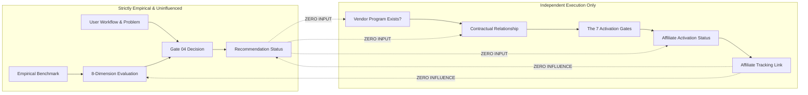

# Affiliate Operations Framework v1.0
## Operational Procedures, Commercial Decoupling & Activation Governance for the LOCATRIA Resource Layer

---

### Document Control
- **Document ID**: `DOC-A4-2-AFFILIATE-OPERATIONS-v1.0`
- **System**: GDBS OS / LOCATRIA
- **Module**: 07 — Content & Knowledge Operating System
- **Chapter**: 01 — Content Production System
- **Sprint**: A.4.2 — Affiliate Operations v1.0
- **Status**: OPERATIONAL / PASS
- **Review Date**: 2026-09-26
- **Reviewer**: LOCATRIA Commercial Governance Board & Founder

---

## 1. Objective & Scope

The objective of **A.4.2 — Affiliate Operations v1.0** is to operationalize the commercial and affiliate execution layer across the LOCATRIA platform while establishing an unbreachable wall between commercial arrangements and editorial recommendations.

This framework governs:
1. **The Commercial Lifecycle**: From vendor program discovery, relationship contracting, and technical activation through to ongoing maintenance, pausing, and offboarding.
2. **The 7-Gate Activation Engine**: Objective prerequisites required before any commercial tracking link can be enabled.
3. **Canonical Link Integrity**: Preservation of direct vendor URLs in Tool entities, ensuring that affiliate links never overwrite or corrupt foundational canonical metadata.
4. **Contextual Disclosure Standards**: Strict compliance with statutory advertising standards (FTC, international consumer protection) and reader transparency.
5. **Decoupled Governance Integration**: How commercial reviews (`AFFILIATE_CHANGE`) are processed without contaminating empirical tool evaluations or editorial recommendations.

### Out of Scope / Hard Boundaries
- **Zero Real Activations in This Sprint**: No affiliate program is activated during Sprint A.4.2; all 10 pilot entities remain strictly `locatria_affiliate_relationship: NOT_CONTRACTED`, `affiliate_activation_status: NOT_ACTIVATED`, and `status: NONE`.
- **Zero Production Affiliate Links**: No commercial tracking links are added to published articles (#01–#38) or resource templates.
- **Zero Editorial Interference**: No recommendation status, empirical score, priority, or ranking is influenced by commercial variables.
- **No Fabricated Data**: Affiliate availability and partner programs are audited against official vendor documentation.

---

## 2. Decoupling Axiom: Commercial Independence

The foundational premise of LOCATRIA’s authority is absolute editorial autonomy. To guarantee trust, the system enforces mathematical and logical separation across four independent vectors:

```text
Vendor Affiliate Program Availability
                ≠
LOCATRIA Affiliate Relationship
                ≠
Affiliate Activation Status
                ≠
Recommendation Status
```



### Prohibited Influences
Under no circumstances may commercial affiliate status or commission rates:
1. Alter a tool's 8-dimension qualitative evaluation score.
2. Upgrade a tool from `LISTED` to `CONDITIONALLY_RECOMMENDED` or `RECOMMENDED`.
3. Influence ranking order or visual prominence on any workflow or comparison page.
4. Prevent the downgrade or retirement of an underperforming tool.
5. Replace a tool's direct canonical URL (`official_url`).

---

## 3. Vendor Program Verification Process

Before LOCATRIA acknowledges that a tool has an affiliate program, the program must be verified through primary vendor sources.

```text
UNKNOWN  ──[Primary Audit]──>  TRUE (Source Verified)
                           └──>  FALSE (No Program / Self-Hosted / Enterprise Only)
```

### Verification Criteria
1. **Direct Vendor Domain Audit**: The vendor must host an official affiliate, partner, or referral landing page on their primary domain (e.g., `vendor.com/affiliates`, `vendor.com/partners`).
2. **Recognized Affiliate Network**: If hosted on a third-party affiliate network (e.g., Impact, PartnerStack, ShareASale, CJ, Rewardful, Tolt), the program listing must be verified as official and actively accepting applications.
3. **Product Scope Confirmation**: The affiliate program must apply specifically to the software tier or product evaluated in LOCATRIA (e.g., OpenAI offers enterprise partnerships but no public affiliate program for ChatGPT Plus; Google Labs offers no affiliate program for NotebookLM).
4. **Source Recording**: The canonical source URL must be recorded in `program_source_url` alongside the verification date in `last_verified`.

---

## 4. Contractual & Network Setup

When LOCATRIA elects to establish a commercial relationship with an eligible vendor, the relationship moves through a formal contracting workflow:

```text
NOT_CONTRACTED  ──[Apply]──>  PENDING  ──[Contract Executed]──>  ACTIVE
                                       └──[Rejected / Withdrawn]──>  NOT_CONTRACTED
```

### Supported Partner Models
1. **Network Intermediaries**:
   - SaaS Affiliate Platforms: *PartnerStack, Rewardful, FirstPromoter, Tolt*.
   - Enterprise Affiliate Networks: *Impact.com, CJ Affiliate, ShareASale, Awin*.
2. **Direct Vendor Agreements**:
   - Custom referral contracts executed directly with software publishers.

### Operational Requirements
- Contract terms must be audited for cookie duration, payout thresholds, and non-disparagement clauses. LOCATRIA will **never** sign agreements that restrict negative editorial reviews or mandate positive endorsements.

---

## 5. The 7 Canonical Activation Gates

Before any verified, contracted affiliate program can transition to `affiliate_activation_status: ACTIVATED` and `status: ACTIVE`, all seven activation gates must be satisfied and validated by the automated governance engine (`validation/affiliate-operations.js`):

```text
Gate 1: Vendor Program Officially Verified
   ↓
Gate 2: Contractual Relationship Established
   ↓
Gate 3: Terms, Commission & Policies Audited
   ↓
Gate 4: Destination & Tracking Link Integrity
   ↓
Gate 5: Contextual Disclosure Framework Assigned
   ↓
Gate 6: Responsible Internal Owner Assigned
   ↓
Gate 7: Governance & Tool State Clearance (Tool NOT RETIRED, Founder Authorized)
   ↓
[ALL 7 CLEARED]  ──>  ACTIVATED / ACTIVE
```

### Gate Specifications

| Gate ID | Name | Requirement | Validation Method |
| :--- | :--- | :--- | :--- |
| **GATE-01** | Vendor Program Verified | `affiliate_program_available === 'TRUE'`, `verification_status === 'VERIFIED'`, valid `program_source_url` | Automated regex URI validation and enum match |
| **GATE-02** | Contract Established | `locatria_affiliate_relationship === 'ACTIVE'`, named `program` and `network` (cannot be "None") | String completeness and state audit |
| **GATE-03** | Terms Audited | `last_verified` date (YYYY-MM-DD) present; substantive notes ($\ge 10$ chars) detailing commission & cookie window | Format check and note length assertion |
| **GATE-04** | Link Integrity | Valid `affiliate_url` provided; strictly distinct from `tool.official_url`; non-empty canonical target | URI format test & string difference check |
| **GATE-05** | Contextual Disclosure | `disclosure_required === true`; standard FTC disclosure string linked | Boolean check & compliance flag |
| **GATE-06** | Responsible Owner | `responsible_owner` explicitly assigned (e.g., Commercial Operations lead) | Non-empty string audit |
| **GATE-07** | Governance Clearance | Target tool is NOT in `RETIRED` state; explicit founder authorization recorded | Lifecycle state cross-check & note audit |

---

## 6. Link Integrity & Canonical URL Preservation

A cornerstone of LOCATRIA’s data model is the immutability of the Tool canonical URL.

### Canonical Preservation Rules
1. **`tool.official_url` is Inviolable**:
   - Represents the true, permanent, unmonetized home of the product (e.g., `https://openai.com/chatgpt`, `https://notebooklm.google.com`).
   - Must NEVER be overwritten with an affiliate tracking link.
   - Must NEVER point to an affiliate network domain (`impact.com`, `partnerstack.com`, `shareasale.com`, etc.).
2. **`affiliate_url` is Strictly Secondary**:
   - Stored exclusively in the `affiliate` entity (`resource-data/affiliates/aff-*.json`).
   - Only resolved by presentation components when commercial activation is approved and accompanied by required disclosures.
3. **Clean Fallback**:
   - If an affiliate program is paused, ended, or broken, front-end rendering engines automatically and seamlessly fall back to `tool.official_url` without user disruption.

---

## 7. Contextual Disclosure Framework & Policies

LOCATRIA adheres to the highest statutory transparency benchmarks, including the Federal Trade Commission (FTC) Guides Concerning the Use of Endorsements and Testimonials in Advertising (16 CFR Part 255) and international equivalents.

### Disclosure Requirements
1. **Clear and Conspicuous**: Disclosures must be immediately adjacent to any commercial link or recommendation block, using high-contrast, unambiguous typography.
2. **Prior to Action**: Disclosures must appear before or at the moment the user clicks the link, not buried in footers or behind vague icons.
3. **Canonical Disclosure Copy**:
   > *"Disclosure: LOCATRIA provides independent, evidence-based software evaluations. When you purchase through links on our site, we may earn an affiliate commission at zero additional cost to you. This commercial relationship never influences our editorial ratings, benchmark results, or recommendation decisions."*
4. **Rel Attributes**: All outbound commercial links must carry `rel="sponsored nofollow noopener"` attributes to adhere to search engine webmaster guidelines.

---

## 8. Tracking, UTM Parameters & Privacy Architecture

Tracking architecture must balance operational attribution with uncompromising user privacy.

### UTM Parameter Convention
Affiliate tracking URLs and referral redirects adhere to the canonical query schema:
```text
https://[destination_or_network]/?utm_source=locatria&utm_medium=affiliate&utm_campaign=[workflow_id]&utm_content=[tool_id]
```
- `utm_source`: `locatria` (always static)
- `utm_medium`: `affiliate`
- `utm_campaign`: Canonical workflow identifier (e.g., `wf-aicontent-001`)
- `utm_content`: Canonical tool identifier (e.g., `tool-can-003`)

### Privacy Commitments
- **Zero PII**: No Personally Identifiable Information (PII) is ever passed in tracking URLs.
- **Zero Third-Party Tracking Scripts**: LOCATRIA does not embed client-side affiliate tracking pixels, canvas fingerprinters, or network beacons on its website. Tracking occurs strictly downstream on vendor landing pages via query parameters.

---

## 9. Ongoing Operational Maintenance & Health Checks

Commercial links degrade over time due to URL restructuring, program sunsets, and landing page reorganizations.

### Maintenance Cadence
1. **Automated Link Verification (Monthly)**:
   - Automated HTTP status checks verify that `affiliate_url` and `destination_url` return `200 OK` responses without broken redirect chains.
2. **Commercial Audit (Quarterly)**:
   - Verify commission rates, payout standing, and vendor terms.
   - Update `last_verified` timestamp in the affiliate record.
3. **Tool Lifecycle Synchronization**:
   - Any state change in the Tool entity (`UNDER_REVIEW`, `DOWNGRADED`, `RETIRED`) immediately prompts an affiliate review check.

---

## 10. Pause, Deactivation & Offboarding Lifecycle

When a commercial relationship is disrupted, the affiliate state transitions cleanly without affecting content integrity:

```text
ACTIVATED ──[Temporary Issue: Broken URL / Payment Dispute]──> PAUSED ──[Resolved]──> ACTIVATED
    │                                                            │
    └──────────────────────[Program Terminated]──────────────────┴──> ENDED
```

### Operational Responses
- **On `PAUSED`**: The presentation layer suppresses the affiliate tracking link and renders the tool's canonical `official_url`.
- **On `ENDED`**: The affiliate record is permanently archived with `locatria_affiliate_relationship: ENDED` and `affiliate_activation_status: ENDED`. Historical operational data is retained for audit compliance.

---

## 11. Affiliate Review Triggers & Integration with Governance

Sprint A.4.1 established the canonical `REVIEW_TRIGGERS.AFFILIATE_CHANGE` event. Sprint A.4.2 formalizes its operational execution:

```text
Event: AFFILIATE_CHANGE
   ├── Vendor terminates affiliate program
   ├── Vendor modifies commission structure
   ├── Affiliate link redirects to 404 / broken page
   └── Contract renegotiation required
```

### Resolution Logic (`validation/affiliate-operations.js`)
```javascript
resolveAffiliateReviewTrigger(event, currentAffiliate, currentTool, currentRec)
```
- **Editorial Decoupling Guarantee**:
  `editorialImpact.unaffected === true`  
  `recommendationStatusBefore === recommendationStatusAfter`
- Commercial events trigger administrative and operational updates (setting `PAUSED` or `ENDED`), but produce **zero automatic modification** to recommendation statuses (`RECOMMENDED`, `CONDITIONALLY_RECOMMENDED`, `LISTED`).

---

## 12. Historical Status & Audit Trail Preservation

To ensure complete transparency and historical accountability:
1. **Version-Controlled Repository**: All affiliate metadata is stored as JSON in `resource-data/affiliates/` under Git version control.
2. **Audit Timestamps**:
   - `last_verified`: Date of most recent commercial verification.
   - `date_applied`: Date of initial network/vendor application.
   - `date_activated`: Date all 7 activation gates were passed and link enabled.
   - `date_paused_ended`: Date of status suspension or offboarding.
3. **Commit Log Integrity**: Changes to affiliate status must be accompanied by explicit commit messages referencing documented vendor communications.

---

## 13. Operational Verification & Test Suite Summary

The Affiliate Operations Engine is protected by a dedicated 10-point automated regression test suite:
- **Test Script**: `validation/test-affiliate-operations.js`
- **CLI Command**: `npm run test:affiliates` (or `node validation/test-affiliate-operations.js`)

### Test Coverage Matrix

| Test ID | Test Scenario | Verified Condition | Result |
| :--- | :--- | :--- | :--- |
| **01** | Vendor No Affiliate Program | Decoupled baseline (`NOT_CONTRACTED` / `NONE`) valid; link integrity confirmed | PASS ✓ |
| **02** | Vendor Program Available, LOCATRIA Not Contracted | Decoupling verified; vendor program noted without contracting | PASS ✓ |
| **03** | Vendor Program + LOCATRIA Active | All 7 activation gates cleared; full compliance confirmed | PASS ✓ |
| **04** | Activation Without Verified Program | Gate 1 blocks activation attempt on unverified vendor | PASS ✓ |
| **05** | Affiliate Link Replacing `official_url` | Network domain in canonical `official_url` blocked; link integrity preserved | PASS ✓ |
| **06** | Missing/Unverified Affiliate URL | Gate 4 blocks activation when tracking URL is absent or invalid | PASS ✓ |
| **07** | Commercial Affiliate Change vs Recommendation | Vendor program termination updates affiliate state to `ENDED` while recommendation remains strictly unchanged | PASS ✓ |
| **08** | Commercial Affiliate Activation vs Evaluation | Activating affiliate leaves 8-dimension empirical scores strictly invariant | PASS ✓ |
| **09** | Activation on RETIRED Tool | Gate 7 blocks commercial activation for deprecated/retired software assets | PASS ✓ |
| **10** | Production Affiliate Baseline Integrity | 100% of production affiliate records (10/10) verified in `NOT_CONTRACTED` / `NOT_ACTIVATED` / `NONE` baseline | PASS ✓ |

---

## 14. Current LOCATRIA Inventory Status & Stop Condition Statement

### Commercial Status Matrix (Pilot Workflow `WF-AICONTENT-001`)

| Tool ID | Tool Name | Recommendation Status | Vendor Program Available | LOCATRIA Relationship | Activation Status | Canonical `status` |
| :--- | :--- | :--- | :--- | :--- | :--- | :--- |
| `TOOL-CAN-001` | NotebookLM | CONDITIONALLY_RECOMMENDED | FALSE | NOT_CONTRACTED | NOT_ACTIVATED | NONE |
| `TOOL-CAN-002` | AlsoAsked | LISTED | TRUE | NOT_CONTRACTED | NOT_ACTIVATED | NONE |
| `TOOL-CAN-003` | Frase | LISTED | TRUE | NOT_CONTRACTED | NOT_ACTIVATED | NONE |
| `TOOL-CAN-004` | Content Harmony | CONDITIONALLY_RECOMMENDED | TRUE | NOT_CONTRACTED | NOT_ACTIVATED | NONE |
| `TOOL-CAN-005` | Hemingway Editor | CONDITIONALLY_RECOMMENDED | FALSE | NOT_CONTRACTED | NOT_ACTIVATED | NONE |
| `TOOL-CAN-006` | Claude | RECOMMENDED | FALSE | NOT_CONTRACTED | NOT_ACTIVATED | NONE |
| `TOOL-CAN-007` | ChatGPT / GPT-4o | CONDITIONALLY_RECOMMENDED | FALSE | NOT_CONTRACTED | NOT_ACTIVATED | NONE |
| `TOOL-CAN-008` | Grammarly Business | LISTED | TRUE | NOT_CONTRACTED | NOT_ACTIVATED | NONE |
| `TOOL-CAN-010` | Diffchecker | CONDITIONALLY_RECOMMENDED | FALSE | NOT_CONTRACTED | NOT_ACTIVATED | NONE |
| `TOOL-CAN-011` | Screaming Frog | CONDITIONALLY_RECOMMENDED | FALSE | NOT_CONTRACTED | NOT_ACTIVATED | NONE |

### Stop Condition Statement
In strict accordance with the core governance boundaries of Sprint A.4.2:
1. **Zero Real Affiliate Activations**: Exactly **0 out of 10** tools possess active commercial affiliate links. All 10 entities are confirmed `NOT_CONTRACTED`, `NOT_ACTIVATED`, and `NONE`.
2. **Zero Content Modifications**: No published articles (#01–#38), existing recommendations, evaluations, or rankings have been modified.
3. **Link Integrity Confirmed**: 100% of Tool entities retain their canonical, vendor-direct `official_url`.
4. **All 10 Verification Tests Passed**: The test suite guarantees full decoupling, gate validation, and lifecycle safety.
5. **Ready for Controlled Future Activation**: The technical, legal, and operational infrastructure is now fully prepared to support future commercial activations under strict 7-gate governance.
