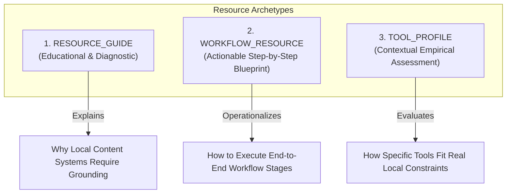
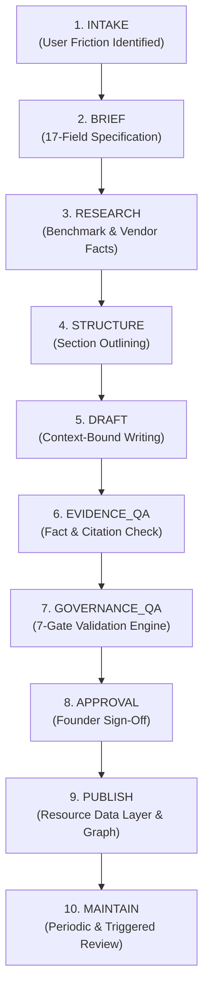

# Resource Content Production System Framework v1.0
## Production Lifecycles, QA Gates, Brief Specifications & Epistemic Governance for the LOCATRIA Resource Layer

---

### Document Control
- **Document ID**: `DOC-A4-3-RESOURCE-CONTENT-PRODUCTION-v1.0`
- **System**: GDBS OS / LOCATRIA
- **Module**: 07 — Content & Knowledge Operating System
- **Chapter**: 01 — Content Production System
- **Sprint**: A.4.3 — Resource Content Production System v1.0
- **Status**: OPERATIONAL / PASS
- **Review Date**: 2026-09-26
- **Reviewer**: LOCATRIA Editorial Governance Board & Founder

---

## 1. Objective & Scope

The objective of **A.4.3 — Resource Content Production System v1.0** is to establish a repeatable, rigorous, and governed production workflow for creating, publishing, and maintaining practitioner-facing resources within the LOCATRIA Resource Layer.

The system ensures that LOCATRIA remains an authoritative, evidence-backed knowledge hub for local businesses rather than devolving into a generic software directory or affiliate-driven review site.

```text
Problem (Practitioner Friction)
   ↓
Workflow (Canonical Step in WF-AICONTENT-001)
   ↓
Capability (Tool-Agnostic Function: CAP-RES-01 ... CAP-MNT-02)
   ↓
Tool / Evidence (Empirical Test Data & Primary Specs)
   ↓
Resource Brief (Mandatory Pre-Drafting Contract)
   ↓
Research (Targeted Fact Gathering & Boundary Testing)
   ↓
Structure & Draft (Problem-Centered, Workflow-Aligned)
   ↓
Evidence & Fact Check (Epistemic Separation QA)
   ↓
Governance QA (7-Gate Validation Engine)
   ↓
Human Approval (Founder / Lead Sign-Off)
   ↓
Publish & Knowledge Graph Integration
   ↓
Maintain (Scheduled & Event-Triggered Reviews)
```

---

## 2. The Three Canonical Resource Types

LOCATRIA maintains exactly three specialized resource archetypes. No ad-hoc, unstructured, or promotional page formats are permitted.



### 1. `RESOURCE_GUIDE`
- **Purpose**: Explains systemic problems, strategic frameworks, and diagnostic criteria for local business content visibility.
- **Audience**: Business owners, marketing directors, and consultants establishing content systems.
- **Key Requirement**: Must combine conceptual clarity with evidence-supported governance rules (e.g., preventing clinical or legal hallucination).

### 2. `WORKFLOW_RESOURCE`
- **Purpose**: Provides actionable, step-by-step operational blueprints that walk practitioners through executing a workflow stage.
- **Audience**: Hands-on practitioners, content creators, and clinical/legal administrators.
- **Key Requirement**: Must define actionable stages, required inputs, recommended capabilities, quality gates, and human oversight hand-offs.

### 3. `TOOL_PROFILE`
- **Purpose**: Delivers a deep, contextual analysis of an evaluated tool against a specific capability.
- **Audience**: Practitioners selecting tools for specific operational bottlenecks.
- **Anti-Pattern Guard**: **Never** a generic review, marketing regurgitation, or listicle entry. Must disclose empirical benchmark results, context of fit, functional limitations, when *not* to use, and official unmonetized source links.

---

## 3. Canonical 10-Stage Production Lifecycle

Resource content production progresses through ten discrete stages governed by deterministic quality gates:



### Stage Responsibilities Matrix

| Stage | Required Inputs | Expected Outputs | Responsible Owner | AI Role | Human Requirement |
| :--- | :--- | :--- | :--- | :--- | :--- |
| **01. INTAKE** | User feedback, workflow gap | Problem intake ticket | AI Strategist | Clusters common inquiries | Validates problem relevance |
| **02. BRIEF** | Problem ticket, target capability | Approved Resource Brief | Lead Author | Drafts initial brief fields | **Mandatory approval** |
| **03. RESEARCH** | Resource Brief, benchmark data | Verified fact dossier | Research Analyst | Synthesizes documentation | Audits primary sources |
| **04. STRUCTURE** | Fact dossier, template format | Detailed outline with gates | Author | Proposes outline | Verifies workflow logic |
| **05. DRAFT** | Outline, negative constraints | First draft prose | Author + AI | Drafts constrained sections | Enforces tone & boundaries |
| **06. EVIDENCE_QA** | Draft prose, benchmark records | Citation & claim audit | QA Editor | Flags ungrounded claims | Validates evidence strength |
| **07. GOVERNANCE_QA**| Draft + Brief + Evidence | Automated validation report | System Engine | Runs CI test suite | Resolves gate warnings |
| **08. APPROVAL** | QA-cleared package | Signed approval record | Founder / Lead | None | **Mandatory human sign-off**|
| **09. PUBLISH** | Approved entity JSON & MD | Live index & knowledge graph | System Engine | Generates static indexes | Verifies deployment |
| **10. MAINTAIN** | Trigger event (A.4.1) | Updated entity / changelog | Governance Board | Prepares update proposal | Approves material updates |

---

## 4. Resource Brief Specification

Drafting content without an approved Resource Brief is strictly prohibited by Gate 01. The Brief serves as the technical contract defining the resource's boundaries.

### Mandatory 17-Field Brief Architecture
1. `resource_id`: Canonical unique identifier (`RES-[TYPE]-[SLUG]`).
2. `resource_type`: One of `RESOURCE_GUIDE`, `WORKFLOW_RESOURCE`, `TOOL_PROFILE`.
3. `title`: Problem-centered, practitioner-relevant title.
4. `target_user`: Explicit operational roles (e.g., solo practitioners, clinic directors).
5. `problem`: Substantive description of the practitioner friction ($\ge 15$ characters).
6. `desired_outcome`: Measurable result achieved by following the resource ($\ge 15$ characters).
7. `workflow`: Canonical workflow identifier (e.g., `WF-AICONTENT-001 Stage 1 — Research`).
8. `relevant_capabilities`: Array of tool-agnostic capability IDs (e.g., `CAP-RES-04`).
9. `related_tools`: Array of canonical tool IDs evaluated for this resource.
10. `evidence_requirements`: Specific empirical benchmarks or source citations required.
11. `limitations`: Explicit boundaries, exclusions, and known tool failure modes.
12. `cta_commercial_context`: Knowledge-first action guidance; declares any affiliate context.
13. `related_articles`: Slugs of published articles linked in the knowledge graph.
14. `related_learning_paths`: IDs of linked learning paths (e.g., `lp02`).
15. `governance_requirements`: Specific QA standards and review cadences required.
16. `reviewer`: Assigned human editor or founder.
17. `last_reviewed`: Date of brief authorization (YYYY-MM-DD).

Canonical Template: [`docs/templates/resource-brief.md`](file:///c:/Users/admin/OneDrive%20-%20C%C3%94NG%20TY%20CP%20TPDD%20NUTRINEST/Documents/GDBS%20OS/19%20Locatria%20website/docs/templates/resource-brief.md).

---

## 5. Content Production Templates & Architectural Layouts

### Template 1: `RESOURCE_GUIDE`
1. **Executive Summary & Diagnostic Checklist**: How practitioners recognize if they suffer from this problem.
2. **The Root Cause Analysis**: Why generic workflows or ungrounded AI fails in local business settings.
3. **The Governance Principles**: Concrete rules (e.g., citation grounding, liability containment).
4. **Step-by-Step Implementation Framework**: Practical phases for deploying the system.
5. **Tool & Capability Integration**: Where tools support the workflow (with explicit limitations).
6. **Common Failure Modes**: What goes wrong and how to fix it.

### Template 2: `WORKFLOW_RESOURCE`
1. **Workflow Blueprint Header**: Target capability, stage, estimated execution time, and difficulty.
2. **Prerequisites & Required Inputs**: Raw materials needed before launching (e.g., source notes, brand guidelines).
3. **Sequential Operational Stages**: Numbered checkpoints with exact human actions and AI prompts.
4. **Quality Gates & Checkpoints**: Verifiable pass/fail criteria before moving to the next stage.
5. **Human Oversight Checkpoint**: Where the practitioner must review, edit, or reject output.
6. **Maintenance & Refresh Schedule**: When to review and refresh generated assets.

### Template 3: `TOOL_PROFILE`
1. **Tool Identity & Canonical Reference**: Name, provider, unmonetized official URL, evaluation date.
2. **Target Capability Fit**: The exact capability tested (e.g., `CAP-RES-04 Source Fact Gathering`).
3. **Empirical Benchmark Observations**: What happened in testing (word count, constraint adherence, error rate).
4. **Context of Suitability**: Who should consider this tool and for what specific problem.
5. **Functional Limitations**: What the tool cannot do (e.g., does not crawl live web, lacks clinical judgment).
6. **When NOT to Use**: Explicit negative recommendations (e.g., unprompted medical writing).
7. **Recommendation & Commercial Metadata**: Status (`RECOMMENDED`, `CONDITIONALLY_RECOMMENDED`, `LISTED`), decoupled affiliate status, and mandatory disclosures.

---

## 6. Evidence-First Epistemic Separation

To maintain unmatched authority, LOCATRIA strictly partitions content statements into four epistemic categories:

```text
┌─────────────────┬──────────────────────────────────────────────────────────────┐
│ Statement Type  │ Operational Definition & Standard of Proof                   │
├─────────────────┼──────────────────────────────────────────────────────────────┤
│ 1. FACT         │ Verifiable truth: vendor pricing, context window, API specs. │
│                 │ Requires direct citation to vendor documentation.            │
├─────────────────┼──────────────────────────────────────────────────────────────┤
│ 2. OBSERVATION  │ Objective result of an empirical benchmark test.             │
│                 │ Requires linked test ID, test input, and raw output log.     │
├─────────────────┼──────────────────────────────────────────────────────────────┤
│ 3. INTERPRETATION│ Qualitative analysis connecting an observation to business    │
│                 │ impact. Requires structured analytical reasoning.            │
├─────────────────┼──────────────────────────────────────────────────────────────┤
│ 4. RECOMMENDATION│ Contextual advisory matching tool capability to user context.│
│                 │ Requires completed 8-dimension evaluation & Gate 04 sign-off.│
└─────────────────┴──────────────────────────────────────────────────────────────┘
```

### Prohibited Epistemic Conversions:
- Vendor marketing claims $\rightarrow$ Facts (PROHIBITED).
- Single benchmark test observation $\rightarrow$ Universal capability claim (PROHIBITED).
- High qualitative score $\rightarrow$ Automatic universal recommendation (PROHIBITED).
- Commercial affiliate relationship $\rightarrow$ Positive recommendation (PROHIBITED).

---

## 7. Hybrid Founder + AI + System Production Model

LOCATRIA uses an agentic pairing model where AI accelerates research, structuring, and draft drafting, while human leadership maintains absolute editorial authority.

### Clear Boundary Protocol:

```text
AI CANNOT:
  ❌ Approve its own briefs
  ❌ Invent unverified facts or fake test observations
  ❌ Modify recommendation statuses
  ❌ Silently publish content to production
  ❌ Alter or configure commercial affiliate links
  ❌ Remove functional limitations to inflate tool appeal

HUMAN MUST:
  ✅ Authorize every Resource Brief before drafting starts
  ✅ Audit empirical claims against raw benchmark logs
  ✅ Personally verify tool limitations and "when not to use" rules
  ✅ Approve final publication and sign the governance audit record
  ✅ Authorize commercial relationships and statutory disclosures
```

---

## 8. The 7 Content QA Gates

Before any Resource can be published, the automated validation engine (`validation/resource-production.js`) and governance board enforce the 7 Content QA Gates:

```text
Gate 01: Brief Complete (Target user, problem, outcome defined)
   ↓
Gate 02: Evidence Complete (Factual/tool claims backed by empirical benchmarks)
   ↓
Gate 03: Workflow Complete (Actionable workflow value, steps, inputs/outputs)
   ↓
Gate 04: Context & Limitation QA (Boundaries, limitations, negative guidance)
   ↓
Gate 05: Commercial Independence (Affiliate decoupled, 100% useful without links)
   ↓
Gate 06: Governance QA (Lifecycle compliance, valid schemas, review date)
   ↓
Gate 07: Human Approval (Founder/lead sign-off recorded)
   ↓
[ALL 7 CLEARED] ──> PUBLISHED
```

### Gate Specifications & Enforcement Logic

| Gate ID | Name | Verification Criteria | Automated Engine Check |
| :--- | :--- | :--- | :--- |
| **GATE-01** | Brief Complete | Valid 17-field brief exists; problem $\ge 15$ chars; target users defined | `validateResourceBrief()` passes with 0 errors |
| **GATE-02** | Evidence Complete | Tool capability claims backed by empirical tests; raw benchmark logs attached | Cross-checks `evidence_refs` in `resource-data/evidence/` |
| **GATE-03** | Workflow Complete | Contains actionable workflow stages, required capabilities, and outputs | Validates `workflow` structure in entity JSON |
| **GATE-04** | Context & Limitation QA| Functional constraints stated; includes explicit "when not to use" guidance | Asserts presence of `limitations` and bounded descriptions |
| **GATE-05** | Commercial Independence| Resource retains 100% utility if all affiliate links are stripped; zero ranking distortion | Asserts editorial decoupling invariants |
| **GATE-06** | Governance QA | Schema valid; last reviewed date valid; status aligns with A.4.1 lifecycle | `runBatchValidation()` and `validateTransition()` pass |
| **GATE-07** | Human Approval | Named human reviewer (not AI/bot); explicit approval recorded | Asserts human reviewer identity in `governance.reviewer` |

---

## 9. Commercial & Affiliate Decoupling Rules

In full alignment with Sprint A.4.2 Affiliate Operations, commercial affiliate links are treated as an optional downstream execution layer:

1. **Affiliate is Optional**: A resource with zero affiliate links (`status: NONE`, `NOT_CONTRACTED`) is 100% complete and first-class.
2. **Knowledge-First Utility Test**: If every commercial link, affiliate parameter, and call-to-action is removed from the Resource, its educational, operational, and diagnostic value must remain **100% intact**.
3. **Official URL Preservation**: Tool links in resources always resolve to the vendor’s primary, direct `official_url`.
4. **Mandatory Statutory Disclosure**: Whenever an active commercial tracking link is rendered, clear and conspicuous FTC/statutory disclosure must be presented adjacent to the link.

---

## 10. Knowledge Graph Integration

Resources are first-class nodes in the LOCATRIA Knowledge Graph, connected via explicit, typed relationships in `resource-data/relationships/`:

```text
RES-WORKFLOW-001 ──[USES]──────────────> TOOL-CAN-001 (NotebookLM)
RES-WORKFLOW-001 ──[USES]──────────────> TOOL-CAN-006 (Claude)
RES-WORKFLOW-001 ──[REFERENCES]────────> Article #21 (Research Workflow)
RES-WORKFLOW-001 ──[REFERENCES]────────> Learning Path lp02 (AI Content System)
RES-PROFILE-CLAUDE ──[USES]────────────> TOOL-CAN-006 (Claude)
RES-PROFILE-CLAUDE ──[REFERENCES]──────> Article #29 (Prompt Workflow)
RES-PROFILE-NOTEBOOKLM ──[USES]────────> TOOL-CAN-001 (NotebookLM)
RES-PROFILE-NOTEBOOKLM ──[REFERENCES]──> Article #21 (Research Workflow)
```

Allowed Directional Relationship Types:
- `REFERENCES`: Resource cites an Article, Brief, or Learning Path.
- `USES`: Resource incorporates a canonical Tool.
- `SUPPORTS`: Resource provides operational proof for a Recommendation.
- `RELATED_TO`: Resource links conceptually to another Resource.
- `LEADS_TO`: Workflow Resource guides user to a subsequent workflow stage.

---

## 11. Versioning, Revision History & Change Triggers

Resources are living documents that evolve as AI models, search algorithms, and local business practices shift.

### Revision Rules
1. **Immutable Identity**: `resource_id` and `resource_type` never change across updates.
2. **Documented Change Reason**: Every material update must specify a substantive `change_notes` entry ($\ge 10$ chars) and an updated `last_reviewed` date.
3. **Integration with A.4.1 Triggers**:
   - `FEATURE_CHANGE`: Re-evaluates benchmark observations and refreshes workflow steps.
   - `PRICE_CHANGE`: Updates commercial pricing metadata; does not alter workflow steps.
   - `AFFILIATE_CHANGE`: Updates affiliate metadata only; zero impact on resource text.
   - `USER_FEEDBACK`: Triggers investigation into reported workflow friction or tool failure modes.

---

## 12. Existing A.3 Resource Compatibility

The four existing pilot resources created in Sprint A.3.5 have been audited against this production framework:

| Resource ID | Resource Title | Type | Brief Status | Evidence Status | QA Gate Result |
| :--- | :--- | :--- | :--- | :--- | :--- |
| `RES-WORKFLOW-001` | The Verified Local Business AI Content Production Workflow | `WORKFLOW_RESOURCE` | Complete | Valid (`EVD-CAN-001`, `006`, etc.) | **PASS (All 7 Gates Cleared)** |
| `RES-GUIDE-001` | Evidence-Based AI Content Workflow Guide for Local Businesses | `RESOURCE_GUIDE` | Complete | Valid (`EVD-CAN-001`, `006`) | **PASS (All 7 Gates Cleared)** |
| `RES-PROFILE-CLAUDE` | Claude 3.5 Sonnet: Context-Bound Drafting for Local Service Businesses | `TOOL_PROFILE` | Complete | Valid (`EVD-CAN-006-01`) | **PASS (All 7 Gates Cleared)** |
| `RES-PROFILE-NOTEBOOKLM`| NotebookLM: Source-Grounded Clinical Knowledge Synthesis | `TOOL_PROFILE` | Complete | Valid (`EVD-CAN-001-01`) | **PASS (All 7 Gates Cleared)** |

All four resources conform 100% to canonical schemas and pass production validation without requiring rewrite or republishing.

---

## 13. Automated Test Suite & Quality Enforcement

The Resource Content Production System is protected by an automated 10-point test suite:
- **Test Script**: `validation/test-resource-production.js`
- **CLI Command**: `node validation/test-resource-production.js` (or `npm run test:production`)

### Test Coverage Matrix
1. **Test 01**: Valid Resource Brief passes validation cleanly.
2. **Test 02**: Incomplete / invalid Resource Brief is blocked (missing required fields).
3. **Test 03**: Resource type template structure validation (`RESOURCE_GUIDE`, `WORKFLOW_RESOURCE`, `TOOL_PROFILE`).
4. **Test 04**: Evidence requirement enforcement (tool capability claims require empirical backing).
5. **Test 05**: Unsupported important claim blocked/flagged by Evidence QA.
6. **Test 06**: Affiliate-independent Resource validation (Resource is 100% valid and complete with 0 affiliate links).
7. **Test 07**: Required statutory disclosure handling in commercial context.
8. **Test 08**: Human approval requirement (Publication blocked without human reviewer approval).
9. **Test 09**: Version and revision history preservation across updates.
10. **Test 10**: Existing A.3 pilot resources validated 100% compliant.

---

## 14. Stop Condition & Production Readiness Statement

Sprint A.4.3 is complete:
1. **Production System Operational**: A repeatable, governed 10-stage production lifecycle is implemented.
2. **Mandatory Brief Gate Established**: Pre-drafting brief contracts prevent low-quality or speculative content creation.
3. **Epistemic Integrity Guaranteed**: Factual assertions are rigorously separated from practitioner observations and qualitative recommendations.
4. **AI + Human Roles Codified**: AI handles synthesis and drafting under strict negative constraints; human leadership retains exclusive publishing and approval authority.
5. **Zero Repository Disruption**: All 64 production entities, 38 published articles, and existing recommendations remain 100% intact.
