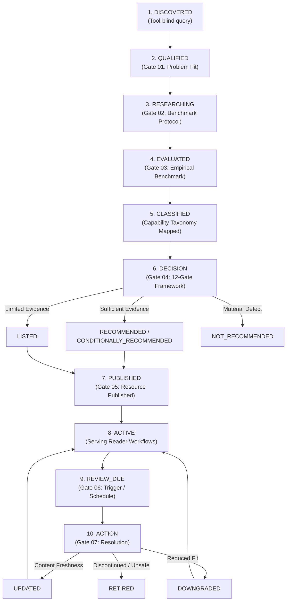

# Resource Lifecycle & Governance Framework v1.0
## Operational State Machines, Transition Gates & Review Policies for the LOCATRIA Resource Layer

---

### Document Control
- **Document ID**: `DOC-A4-1-RESOURCE-LIFECYCLE-GOVERNANCE-v1.0`
- **System**: GDBS OS / LOCATRIA
- **Module**: 07 — Content & Knowledge Operating System
- **Chapter**: 01 — Content Production System
- **Sprint**: A.4.1 — Resource Lifecycle & Governance v1.0
- **Status**: OPERATIONAL / PASS
- **Review Date**: 2026-09-26
- **Reviewer**: LOCATRIA Editorial Governance Board & Founder

---

## 1. Purpose

The purpose of this framework is to establish an objective, repeatable, and automated lifecycle governance system for all entities within the LOCATRIA Resource Layer:
- **Tools**: Software products and AI capabilities evaluated for local businesses.
- **Resources**: Practitioner-facing workflow resources, guides, and tool profiles.
- **Evaluations**: Qualitative, multi-dimensional assessments grounded in empirical benchmarks.
- **Recommendations**: Contextual decisions matching tools to specific local business problems.
- **Affiliates**: Decoupled commercial metadata and contractual activation statuses.
- **Reviews**: Periodic and event-triggered audits ensuring ongoing freshness and truthfulness.

This system guarantees that no tool is recommended without empirical evidence, no commercial relationship influences editorial judgment, and all lifecycle transitions follow documented, verifiable gates.

---

## 2. Scope

This framework governs:
1. **The 5 Canonical Workflow Stages** of `WF-AICONTENT-001` (Research → Brief → Create → Repurpose → Maintain).
2. **The 14 Tool-Agnostic Capabilities** (`CAP-RES-01` through `CAP-MNT-02`).
3. **The 8 Canonical JSON Schemas** and operational validation engine.
4. **All Production Entities** stored in `resource-data/`.
5. **Human and System Roles** across Founder, AI Strategist, and Automated Build Gates.

Out of Scope:
- Modifying historical published articles (#01–#38).
- Introducing external databases or heavyweight CMS infrastructure.
- Arbitrary activation of commercial affiliate links.

---

## 3. Canonical Lifecycle Model

The LOCATRIA Resource Lifecycle governs the progression of knowledge and tools from initial discovery to active publication and long-term maintenance:



### Lifecycle Stage Definitions:
1. **DISCOVERED**: Tool identified via tool-blind conceptual query without vendor bias.
2. **QUALIFIED**: Tool passes Gate 01, confirming relevance to a real local business friction point.
3. **RESEARCHING**: Controlled benchmark inputs, constraints, and test protocols are assembled.
4. **EVALUATED**: Hands-on empirical testing executed; raw outputs preserved; 8-dimension assessment drafted.
5. **CLASSIFIED**: Primary and secondary capabilities mapped to canonical taxonomy IDs.
6. **DECISION**: Evaluated tool filtered through the 12-Gate Recommendation Decision Framework.
7. **PUBLISHED**: Attached to a canonical resource entity and validated against schemas.
8. **ACTIVE**: Live operational resource integrated into the LOCATRIA Knowledge Graph.
9. **REVIEW_DUE**: Scheduled audit date reached or event-driven trigger logged.
10. **ACTION**: Re-evaluation, content update, status downgrade, or formal retirement executed.

---

## 4. Entity-State Separation

A foundational architectural rule of LOCATRIA is that **Entity Lifecycle State**, **Recommendation Status**, **Resource Publication State**, and **Affiliate Commercial State** are independent variables:

$$\mathbf{\text{Tool State}} \;\neq\; \mathbf{\text{Recommendation Status}} \;\neq\; \mathbf{\text{Resource Status}} \;\neq\; \mathbf{\text{Affiliate Status}}$$

```mermaid
classDiagram
    class ToolEntity {
        +tool_id: String
        +lifecycle_status: DISCOVERED | UNDER_REVIEW | EVALUATED | LISTED | CONDITIONALLY_RECOMMENDED | RECOMMENDED | RETIRED
    }
    class RecommendationEntity {
        +recommendation_id: String
        +status: RECOMMENDED | CONDITIONALLY_RECOMMENDED | LISTED | UNDER_REVIEW | NOT_RECOMMENDED | RETIRED
    }
    class ResourceEntity {
        +resource_id: String
        +review_status: DRAFT | REVIEW_DUE | PUBLISHED | ACTIVE | UPDATED | DOWNGRADED | RETIRED
    }
    class AffiliateEntity {
        +affiliate_program_available: TRUE | FALSE | UNKNOWN
        +locatria_affiliate_relationship: NOT_CONTRACTED | PENDING | ACTIVE | ENDED
        +affiliate_activation_status: NOT_ACTIVATED | ACTIVATED | PAUSED | ENDED
    }
    class ReviewEntity {
        +trigger: SCHEDULED | PRICE_CHANGE | FEATURE_CHANGE | AFFILIATE_CHANGE | USER_FEEDBACK | POLICY_CHANGE
        +action: INFORMATION_REFRESH | RE_EVALUATION | RECOMMENDATION_REVIEW | PUBLICATION_UPDATE | DOWNGRADE | RETIREMENT
    }
    ToolEntity "1" --> "0..1" RecommendationEntity : evaluated by
    ToolEntity "1" --> "0..*" ResourceEntity : utilized in
    ToolEntity "1" --> "1" AffiliateEntity : decoupled commercial metadata
    ToolEntity "1" --> "0..*" ReviewEntity : audited by
```



### Why Separation Matters:
- A tool may have `lifecycle_status: RECOMMENDED` while its affiliate entity has `affiliate_program_available: FALSE` and `status: NONE` (e.g., Claude).
- A vendor may offer a 40% affiliate program (`affiliate_program_available: TRUE`), but LOCATRIA's relationship remains `NOT_CONTRACTED`, its activation remains `NOT_ACTIVATED`, and the tool recommendation status is only `LISTED` (e.g., Frase).
- A resource may be `UPDATED` due to a broken outbound link without modifying the tool's underlying evaluation.

---

## 5. Transition Matrix

Every lifecycle state transition must satisfy explicit entry criteria and validation rules:

| Entity | From State | Allowed To State | Required Evidence / Gate | Reversible? | Authority |
|---|---|---|---|---|---|
| **Tool** | `DISCOVERED` | `UNDER_REVIEW`, `EVALUATED` | Gate 01 passed; benchmark protocol assigned | Yes | AI / Editor |
| **Tool** | `DISCOVERED` | `RECOMMENDED` | **FORBIDDEN (Direct jump blocked)** | N/A | System Block |
| **Tool** | `UNDER_REVIEW`| `EVALUATED` | Hands-on empirical benchmark test completed | Yes | Evaluation Lab |
| **Tool** | `EVALUATED` | `RECOMMENDED` | Gate 04 passed (evaluation + evidence + rationale) | Yes | Founder |
| **Tool** | `EVALUATED` | `CONDITIONALLY_RECOMMENDED` | Gate 04 passed with explicit operational constraints | Yes | Founder |
| **Tool** | `EVALUATED` | `LISTED` | Cataloged for research; evidence narrow/limited | Yes | Editor |
| **Tool** | `RECOMMENDED`| `CONDITIONALLY_RECOMMENDED` | Gate 07 Downgrade: increased friction or pricing spike | Yes | Editor / Founder |
| **Tool** | `RECOMMENDED`| `RETIRED` | Product discontinued, persistent errors, safety defect | Conditional | Founder |
| **Tool** | `RETIRED` | `RECOMMENDED` | **FORBIDDEN (Must re-qualify via UNDER_REVIEW)** | N/A | System Block |
| **Tool** | `RETIRED` | `UNDER_REVIEW` | Requalification package assembled; changes verified | Yes | Founder |
| **Resource** | `DRAFT` | `PUBLISHED` | Gate 05 passed; schema valid; relationships resolved | Yes | Editor |
| **Resource** | `PUBLISHED` | `REVIEW_DUE` | Scheduled audit date reached or trigger fired | Yes | System |
| **Resource** | `REVIEW_DUE` | `ACTIVE` / `UPDATED` | Audit completed; updates verified and deployed | Yes | Editor |
| **Resource** | `ACTIVE` | `RETIRED` | Underlying tools obsolete or superseded | No (Archived) | Founder |

---

## 6. Governance Gates

Seven formal governance gates regulate the lifecycle:

```text
Candidate Discovery
       ↓
[GATE 01: Qualification]
       ↓
[GATE 02: Evaluation Readiness]
       ↓
[GATE 03: Empirical Evaluation]
       ↓
[GATE 04: Contextual Recommendation]
       ↓
[GATE 05: Resource Publication]
       ↓
[GATE 06: Operational Review]
       ↓
[GATE 07: Lifecycle Action (Update / Downgrade / Retire)]
```

### Gate 01 — Qualification
- **Question**: Does this candidate solve a documented friction point in `WF-AICONTENT-001`?
- **Entry Criteria**: Tool identified via tool-blind query; mapped to at least 1 canonical capability ID.
- **Pass Verification**: Candidate recorded with official informational URL and target local vertical.

### Gate 02 — Evaluation Readiness
- **Question**: Is the benchmark scenario defined, standardized, and repeatable?
- **Entry Criteria**: Standardized dataset (`LOCATRIA-LB-BENCHMARK-v1.0`) available; test prompt, model version, and access plan documented.
- **Pass Verification**: Test protocol recorded in discovery longlist.

### Gate 03 — Empirical Evaluation
- **Question**: What did the tool actually produce under controlled local business test conditions?
- **Entry Criteria**: Hands-on execution completed; raw text output preserved in `data/evaluation/raw-outputs/`.
- **Pass Verification**: Completed qualitative evaluation across all 8 dimensions; evidence entity created; zero numeric scoring.

### Gate 04 — Contextual Recommendation
- **Question**: Does the empirical evidence support recommending this tool for a specific local business context?
- **Entry Criteria**: Satisfies all 12 Gates of the Recommendation Framework; non-commercial rationale documented; negative boundaries explicit.
- **Pass Verification**: Recommendation entity created with valid `evidence_refs`, `evaluation_ref`, and `when_not_to_use` constraints.

### Gate 05 — Resource Publication
- **Question**: Does the published resource teach a complete workflow and remain valuable without commercial links?
- **Entry Criteria**: Knowledge-first structure; prominent limitations; commercial disclosure if applicable; directional relationships resolve cleanly.
- **Pass Verification**: Resource record validated via Ajv Draft 2020-12; verified in `validate-all.js`.

### Gate 06 — Operational Review
- **Question**: Is the published tool profile or workflow resource still accurate and fresh?
- **Entry Criteria**: Biannual calendar trigger (`SCHEDULED`) reached, or event-driven trigger logged.
- **Pass Verification**: Audit checklist completed comparing current vendor behavior against baseline evidence.

### Gate 07 — Lifecycle Action
- **Question**: What editorial or technical modification is required based on audit findings?
- **Entry Criteria**: Review findings classified into Update, Downgrade, or Retirement.
- **Pass Verification**: Re-evaluation executed if required; status updated; historical changelog preserved.

---

## 7. Review Triggers & Action Mapping

Review triggers govern when and how tools and resources are audited. **Affiliate changes NEVER alter editorial recommendations**:

| Trigger | Description | Required Minimum Action | Can Alter Recommendation Automatically? |
|---|---|---|---|
| `SCHEDULED` | Biannual calendar audit | Information refresh; verify live URLs, pricing, and access | **NO** (Human review required) |
| `PRICE_CHANGE` | Vendor alters pricing, free tier, or credits | Refresh commercial metadata; assess Value dimension | **NO** (Human review required) |
| `FEATURE_CHANGE` | Vendor updates AI model, UI, or capabilities | Execute benchmark test protocol; update Evaluation | **NO** (Human review required) |
| `AFFILIATE_CHANGE` | Vendor creates/modifies/terminates affiliate scheme | Update decoupled commercial metadata entity ONLY | **NEVER** (Zero editorial impact) |
| `USER_FEEDBACK` | Reader reports factual hallucination or friction | Review failure mode; initiate Downgrade evaluation | **NO** (Human review required) |
| `POLICY_CHANGE` | Regulatory shift (FTC, medical/legal advertising) | Audit compliance disclaimers; update warnings | **NO** (Human review required) |
| `SOURCE_CHANGE` | Clinical/scientific guidelines updated | Re-ground benchmark inputs; re-draft test guide | **NO** (Human review required) |
| `OTHER` | Security vulnerabilities, API deprecation | Immediate technical triage; possible temporary PAUSE | **NO** (Founder authorization) |

---

## 8. Recommendation Governance

LOCATRIA preserves 6 canonical recommendation statuses:
- `RECOMMENDED`: High-confidence empirical proof; strong problem fit; minimal workflow friction.
- `CONDITIONALLY_RECOMMENDED`: Proven utility under explicit operational constraints or oversight.
- `LISTED`: Cataloged as an operational research resource; evidence narrow or limited.
- `UNDER_REVIEW`: Active evidence collection or re-evaluation in progress.
- `NOT_RECOMMENDED`: Material mismatch, recurring hallucinations, or unacceptable friction.
- `RETIRED`: Historic recommendation revoked; historical record preserved.

### Core Recommendation Rules:
1. **Evidence Precondition**: `RECOMMENDED` status strictly requires at least 1 empirical evidence record and a completed 8-dimension evaluation.
2. **Qualitative Rationale**: Every recommendation must provide an explicit rationale (minimum 15 characters) explaining *why* the tool fits.
3. **No Automatic Elevation**: A high qualitative fit in one capability does not automatically grant `RECOMMENDED` status.
4. **Commercial Decoupling**: A tool with zero affiliate program can be `RECOMMENDED` (e.g. Claude). A tool with a high affiliate payout can remain `LISTED` or `NOT_RECOMMENDED` (e.g. Frase).
5. **Contextual Scope**: Every recommendation must declare *when to consider* and *when not to use*.
6. **Founder Authority**: Final recommendation status approval rests exclusively with the Founder.

---

## 9. Update, Downgrade & Retire Rules

### 9.1 UPDATE
- **Trigger**: Minor UI refresh, minor pricing shift, or documentation update.
- **Criteria**: The core problem fit, capability performance, and negative constraint compliance remain unchanged.
- **Action**: Update `governance.last_reviewed` and `governance.change_notes`; republish resource.

### 9.2 DOWNGRADE
- **Trigger**: Vendor removes a critical feature from the accessible plan, introduces usage limits, or reader feedback identifies subtle workflow friction.
- **Criteria**: Tool remains viable but requires significantly increased human oversight or higher budget.
- **Action**: Move tool from `RECOMMENDED` to `CONDITIONALLY_RECOMMENDED`, or from `CONDITIONALLY_RECOMMENDED` to `LISTED`. Update resource limitations section prominently.

### 9.3 RETIRE
- **Trigger**: Product discontinued, acquired and shuttered, persistent uncorrected hallucinations, or severe security/privacy defect.
- **Criteria**: Tool is no longer safe or viable for local businesses.
- **Action**: Transition tool and recommendation to `RETIRED`. Append archival banner to published resource. **Never delete the entity file**—preserve full historical evidence and audit trail.

---

## 10. Founder, AI & System Responsibilities

Clear separation of operational responsibilities prevents autonomous AI drift:

| Responsibility Area | Founder | AI Strategist | System / Automated CI |
|---|---|---|---|
| **Problem Definition** | Final Approval | Drafts problem scope | Enforces schema validation |
| **Tool Discovery** | Strategic Guidance | Executes tool-blind search | Validates official URL format |
| **Empirical Benchmarking** | Reviews edge cases | Analyzes test outputs | Preserves raw output files |
| **Qualitative Evaluation** | Approves assessment | Drafts 8-dimension analysis | Checks for forbidden scores |
| **Recommendation Decision** | **Exclusive Authority** | Drafts contextual rationale | Enforces evidence/eval gates |
| **Commercial Contract** | **Exclusive Authority** | Researches public programs | Isolates decoupled metadata |
| **Resource Publishing** | Approves publication | Drafts guide/profile copy | Builds deterministic index |
| **Downgrade / Retirement** | **Exclusive Authority** | Recommends action based on audit | Blocks direct reactivations |

*Governance Invariant: AI agents must never independently promote, demote, or retire a production recommendation.*

---

## 11. Audit & History Requirements

All changes to tools, recommendations, resources, and affiliates must maintain strict auditability:
1. **Governance Block**: Every entity must record `governance.last_reviewed`, `governance.reviewer`, `governance.review_status`, and `governance.change_notes`.
2. **Review Records**: Completed reviews are permanently logged in `resource-data/reviews/` conforming to `review.schema.json`.
3. **Git Immutability**: All lifecycle transitions are committed to local version control with explicit conventional commit messages.
4. **Historical Preservation**: Deprecated evaluations and evidence are retained to document why a tool was historically adopted and subsequently retired.

---

## 12. End-to-End Governance Examples

### Example A: Successful Qualification & Recommendation
1. **Discovery**: Tool-blind search for *"context-bound medical drafting"* discovers Anthropic Claude.
2. **Gate 01**: Mapped to `CAP-CRT-01` within Stage 3 (Create) of `WF-AICONTENT-001`. Status: `DISCOVERED` → `UNDER_REVIEW`.
3. **Gate 02 & 03**: Tested against `LOCATRIA-LB-BENCHMARK-v1.0`. Produced 835-word clinical guide with zero hallucinations. Raw output saved in `TEST-06-claude-raw.txt`. Status: `UNDER_REVIEW` → `EVALUATED`.
4. **Gate 04**: 12 gates satisfied. Non-commercial rationale documented. Founder approves status: `EVALUATED` → `RECOMMENDED`.
5. **Gate 05**: Published as `RES-PROFILE-CLAUDE`. Commercial affiliate entity created with `status: NONE`.

### Example B: Event-Driven Review & Downgrade
1. **Trigger**: Vendor modifies pricing tier, moving custom dictionary rules from standard tier to enterprise plan (`PRICE_CHANGE`).
2. **Gate 06**: Review logged (`trigger: PRICE_CHANGE`). Reviewer assesses Value dimension.
3. **Gate 07**: Editorial board determines the increased cost reduces SMB accessibility.
4. **Action**: Tool recommendation downgraded from `RECOMMENDED` to `CONDITIONALLY_RECOMMENDED`. Resource profile updated with explicit pricing limitation warning.

### Example C: Tool Retirement
1. **Trigger**: Specialized local research tool acquired and shuttered (`FEATURE_CHANGE` / `OTHER`).
2. **Gate 06**: Audit confirms service termination.
3. **Action**: Founder authorizes transition: `RECOMMENDED` → `RETIRED`. Entity retained in repository with `status: RETIRED`; published profile displays archival redirect notice.

---

## 13. Core Governance Principles

1. **Knowledge First, Action Second, Monetization Last**: Readers must receive genuine operational value even if all external links are severed.
2. **Evidence Over Authority**: No vendor claim or brand popularity substitutes for replicated empirical testing.
3. **Strict Commercial Decoupling**: Affiliate commissions have zero bearing on tool evaluation or recommendation status.
4. **Contextual Specificity**: Every recommendation defines where a tool fits and where it fails; universal "best tool" claims are forbidden.
5. **Immutability of Audit Trails**: Historical evidence is preserved forever to maintain institutional memory and reader trust.
