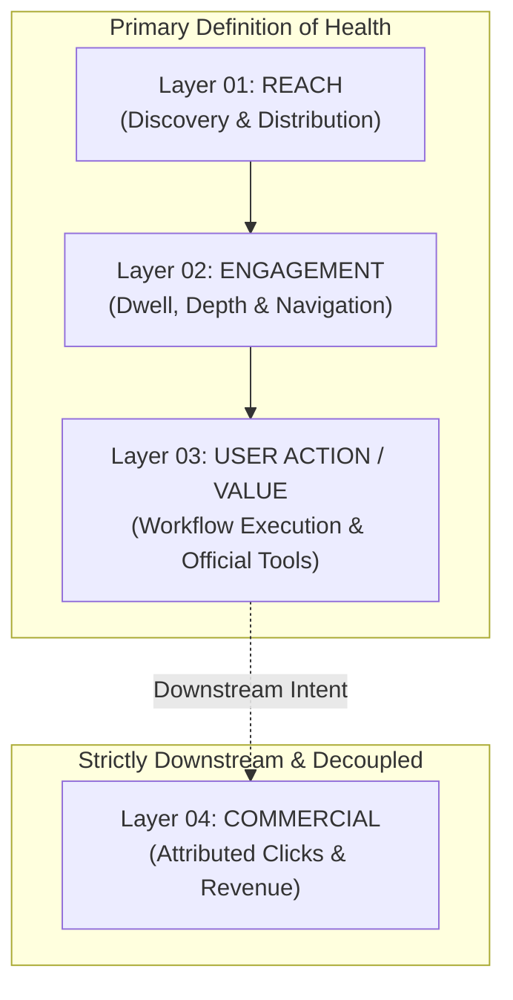

# Resource Measurement Framework v1.0
## Telemetry Architecture, Event Taxonomy, Qualitative Performance & Epistemic Separation for the LOCATRIA Resource Layer

---

### Document Control
- **Document ID**: `DOC-A4-4-RESOURCE-MEASUREMENT-v1.0`
- **System**: GDBS OS / LOCATRIA
- **Module**: 07 — Content & Knowledge Operating System
- **Chapter**: 01 — Content Production System
- **Sprint**: A.4.4 — Resource Measurement v1.0
- **Status**: OPERATIONAL / PASS
- **Review Date**: 2026-09-26
- **Reviewer**: LOCATRIA Analytics & Commercial Governance Board & Founder

---

## 1. Purpose & Core Philosophy

The purpose of **A.4.4 — Resource Measurement v1.0** is to establish an empirical, privacy-preserving telemetry and observation framework for understanding how practitioners discover, consume, and act upon knowledge in the LOCATRIA Resource Layer:

```text
Knowledge (Article / Guide)
   ↓
Resource (Workflow Blueprint / Tool Profile)
   ↓
Tool (Evaluated Capability)
   ↓
User Action (Workflow Navigation / Official Site Visit)
   ↓
Outcome (Knowledge Grounding / Problem Resolved)
   ↓
Commercial Outcome (Downstream Affiliate / Subscription)
```

### The Core Measurement Axiom:
$$\text{User Value is Measured First and Independent from Commercial Value}$$

LOCATRIA rejects the industry-standard affiliate model where page value is defined purely by earnings-per-click (EPC) or conversion rate. A resource that successfully teaches a dental clinic how to eliminate AI clinical hallucination provides **tremendous user value**, even if it generates zero affiliate revenue. Conversely, high affiliate clicks on an unhelpful tool represent **commercial noise**, not editorial success.

---

## 2. Measurement Principles

1. **User Value Precedes Commercial Value**: Telemetry prioritizes learning progression, workflow interaction, and problem resolution over monetization metrics.
2. **Affiliate Revenue $\neq$ Resource Success**: Commercial return is an operational downstream byproduct, never the primary definition of resource health.
3. **Strict Editorial Invariance**: No measurement metric (high traffic, zero traffic, high clicks, low conversions) may automatically alter a Tool's 8-dimension qualitative evaluation or recommendation status.
4. **No False Precision**: Vanity metrics without clear, actionable operational interpretations are strictly excluded.
5. **Privacy by Design**: Telemetry respects practitioner anonymity. No personally identifiable information (PII), invasive fingerprinting, or tracking beacons are deployed.
6. **Epistemic Transparency**: Every metric must declare its origin and data quality (`ACTUAL`, `ESTIMATED`, `MANUAL`, `UNAVAILABLE`). Data fabrication is strictly prohibited.

---

## 3. The Four Measurement Layers

Measurement is structured into four sequential, independent observation layers:



### Layer 01 — Reach
Measures whether practitioners discover the Resource.
- **Metrics**: `RESOURCE_VIEW`, `UNIQUE_RESOURCE_VIEW`.
- **Purpose**: Understand discovery channels (Search, Direct, Knowledge Hub, Newsletter).
- **Rule**: Raw page views indicate visibility, **not** quality or utility.

### Layer 02 — Engagement
Measures whether practitioners actively consume and digest the Resource.
- **Metrics**: `RESOURCE_ENGAGED` (dwell $\ge 45$s), `SCROLL_DEPTH`, `ENGAGEMENT_DURATION`, `RELATED_ARTICLE_CLICK`.
- **Purpose**: Confirm the practitioner spent sufficient time to read the governance rules and workflow checkpoints.

### Layer 03 — User Action / Value
Measures meaningful onward actions demonstrating practical utility.
- **Metrics**: `LEARNING_PATH_CLICK`, `TOOL_VIEW`, `OFFICIAL_TOOL_CLICK`, `RESOURCE_FEEDBACK`.
- **Purpose**: Quantify when a user transitions from passive reader to active practitioner applying a workflow or exploring an official tool.

### Layer 04 — Commercial
Measures commercial execution downstream from user value.
- **Metrics**: `AFFILIATE_CLICK`, `CONVERSION`, `REVENUE`.
- **Purpose**: Track commercial sustainability without allowing monetization signals to contaminate editorial content.

---

## 4. Canonical Event Taxonomy

The system defines 13 canonical telemetry events across the four layers:

| Event Name | Measurement Layer | Trigger Description | Primary Identifier | Epistemic Quality |
| :--- | :--- | :--- | :--- | :--- |
| `RESOURCE_VIEW` | REACH | Resource page loaded by client | `resource_id` | ACTUAL |
| `UNIQUE_RESOURCE_VIEW`| REACH | Unique daily browser visit to resource | `resource_id` | ACTUAL |
| `RESOURCE_ENGAGED` | ENGAGEMENT | Dwell time $\ge 45$s or scroll depth $\ge 60\%$ | `resource_id` | ACTUAL |
| `SCROLL_DEPTH` | ENGAGEMENT | Maximum viewport milestone reached ($25\%, 50\%, 75\%, 100\%$) | `resource_id` | ACTUAL |
| `ENGAGEMENT_DURATION` | ENGAGEMENT | Active client dwell time in seconds | `resource_id` | ACTUAL |
| `RELATED_ARTICLE_CLICK`| ENGAGEMENT | Click on related knowledge article | `resource_id`, `article_id` | ACTUAL |
| `LEARNING_PATH_CLICK` | USER_VALUE | Click on onward learning path | `resource_id`, `path_id` | ACTUAL |
| `TOOL_VIEW` | USER_VALUE | Click to expand or inspect embedded tool profile | `resource_id`, `tool_id` | ACTUAL |
| `OFFICIAL_TOOL_CLICK` | USER_VALUE | Click to visit vendor's unmonetized canonical `official_url` | `resource_id`, `tool_id` | ACTUAL |
| `RESOURCE_FEEDBACK` | USER_VALUE | Practitioner qualitative rating or issue report | `resource_id` | ACTUAL / MANUAL |
| `AFFILIATE_CLICK` | COMMERCIAL | Click on outbound commercial affiliate tracking link | `resource_id`, `tool_id` | ACTUAL |
| `CONVERSION` | COMMERCIAL | Account signup or purchase reported by partner network | `resource_id`, `tool_id` | ACTUAL |
| `REVENUE` | COMMERCIAL | Attributed commission earnings | `resource_id`, `tool_id` | ACTUAL |

---

## 5. Measurement Entity & Schema Specification

All telemetry summaries and period observations are validated against [`schemas/measurement.schema.json`](file:///c:/Users/admin/OneDrive%20-%20C%C3%94NG%20TY%20CP%20TPDD%20NUTRINEST/Documents/GDBS%20OS/19%20Locatria%20website/schemas/measurement.schema.json).

```yaml
entity_type: "measurement"
schema_version: "1.0"
measurement_id: "MEAS-[RESOURCE-SLUG]-[METRIC]-[PERIOD]"
resource_id: "RES-[GUIDE|WORKFLOW|PROFILE]-[SLUG]"
layer: "USER_VALUE" # Options: REACH | ENGAGEMENT | USER_VALUE | COMMERCIAL
metric: "OFFICIAL_TOOL_CLICK"
value: 24
unit: "count"
data_quality: "ACTUAL" # Options: ACTUAL | ESTIMATED | MANUAL | UNAVAILABLE
source: "INTERNAL_EVENT_LOG"
measurement_period:
  start_date: "2026-09-01"
  end_date: "2026-09-26"
captured_at: "2026-09-26"
attribution_context:
  channel: "organic_search"
  tool_id: "TOOL-CAN-006"
notes: "Practitioners clicking from Stage 3 drafting blueprint to Claude official site."
governance:
  review_status: "AUDITED"
  reviewer: "LOCATRIA Analytics Lead"
  last_reviewed: "2026-09-26"
```

---

## 6. User Value Metrics

User Value metrics evaluate whether the Resource fulfilled its diagnostic, educational, or operational promise:

1. **Engagement Rate**:
   $$\text{Engagement Rate} = \frac{\text{RESOURCE\_ENGAGED}}{\text{RESOURCE\_VIEW}}$$
   - Threshold $\ge 40\%$ indicates strong content relevance.
   - Low engagement indicates headline-content mismatch or excessive jargon.
2. **Knowledge Navigation Depth**:
   - Tracking transitions to linked educational articles (`RELATED_ARTICLE_CLICK`) and foundational learning paths (`LEARNING_PATH_CLICK`).
3. **Official Tool Exploration Rate**:
   - Measures clicks to direct vendor documentation (`OFFICIAL_TOOL_CLICK`). High rates indicate the resource effectively guided practitioners toward unmonetized testing.

---

## 7. Commercial Metrics

Commercial metrics are tracked separately in an isolated ledger:

1. **Affiliate Click-Through Rate (CTR)**:
   $$\text{Commercial CTR} = \frac{\text{AFFILIATE\_CLICK}}{\text{RESOURCE\_VIEW}}$$
2. **Commercial Value per Engaged User**:
   $$\text{Revenue per Engaged User} = \frac{\text{REVENUE}}{\text{RESOURCE\_ENGAGED}}$$

### Commercial Isolation Rule:
Under no circumstances may commercial metrics be aggregated with user value metrics into a single blended score. Commercial metrics exist strictly for financial sustainability monitoring.

---

## 8. Attribution Boundaries & Privacy Architecture

LOCATRIA operates on an uncompromising privacy-by-design architecture:

1. **Zero Client Fingerprinting**: No canvas hashes, device IDs, or tracking cookies.
2. **Zero PII Collection**: IP addresses are truncated/anonymized at edge servers; user identifiers are never stored.
3. **Outbound Clean UTMs**: Commercial referral parameters (`utm_source=locatria`) pass only public campaign identifiers. No user-identifying session IDs are passed to vendor sites.
4. **Local Data Processing**: Aggregated logs are parsed locally using deterministic Node.js CLI tools without reliance on opaque third-party scripts.

---

## 9. Data Sources & Epistemic Classification

Every telemetry record must carry an explicit epistemic classification in `data_quality`:

```text
┌─────────────────┬──────────────────────────────────────────────────────────────┐
│ Data Quality    │ Standard of Proof & Operational Meaning                      │
├─────────────────┼──────────────────────────────────────────────────────────────┤
│ 1. ACTUAL       │ Direct, server-verified event count from edge or network log.│
├─────────────────┼──────────────────────────────────────────────────────────────┤
│ 2. ESTIMATED    │ Statistically modeled metric (e.g., sample-scaled dwell time)│
├─────────────────┼──────────────────────────────────────────────────────────────┤
│ 3. MANUAL       │ Observation recorded by human reviewer during audit.         │
├─────────────────┼──────────────────────────────────────────────────────────────┤
│ 4. UNAVAILABLE  │ Metric recognized by schema but currently unmeasured.        │
└─────────────────┴──────────────────────────────────────────────────────────────┘
```

### Prohibited Data Practice:
Fabricating telemetry, mock conversions, or placeholder traffic counts in production files is strictly prohibited. In the absence of live instrumentation, the correct state is **zero records** or `UNAVAILABLE`.

---

## 10. Qualitative Performance Model (Non-Numeric)

LOCATRIA rejects the reduction of complex editorial artifacts into a single universal numeric "Resource Score" (e.g., "Resource Rating: 8.4/10"). Instead, performance is evaluated using a **Qualitative Performance Model**:

```text
┌─────────────────────────────────┬────────────────────────────────────────────┐
│ Performance Signal              │ Diagnostic Criteria                        │
├─────────────────────────────────┼────────────────────────────────────────────┤
│ HIGH_ENGAGEMENT_SIGNAL          │ Engaged view ratio >= 40% of total reach   │
├─────────────────────────────────┼────────────────────────────────────────────┤
│ LOW_ENGAGEMENT_SIGNAL           │ Engaged view ratio < 20% of total reach    │
├─────────────────────────────────┼────────────────────────────────────────────┤
│ STRONG_USER_ACTION_SIGNAL       │ Frequent onward tool/path navigations      │
├─────────────────────────────────┼────────────────────────────────────────────┤
│ WEAK_USER_ACTION_SIGNAL         │ High reach but zero onward actions         │
├─────────────────────────────────┼────────────────────────────────────────────┤
│ COMMERCIAL_ACTIVITY             │ Active affiliate clicks or conversions     │
├─────────────────────────────────┼────────────────────────────────────────────┤
│ INSUFFICIENT_DATA               │ Telemetry sample size < statistical minimum│
└─────────────────────────────────┴────────────────────────────────────────────┘
```

---

## 11. User Value vs Commercial Value Matrix

By plotting User Value against Commercial Activity, the governance board identifies the true health archetype of every resource:

```text
                    USER VALUE (Engagement & Actions)
                      HIGH                     LOW
             ┌─────────────────────────┬─────────────────────────┐
             │ Archetype A:            │ Archetype B:            │
             │ SUSTAINABLE AUTHORITY   │ COMMERCIAL OVERREACH    │
      HIGH   │ High user learning +    │ Users bounce but click  │
             │ healthy monetization.   │ affiliate ads. Audit!   │
COMMERCIAL   ├─────────────────────────┼─────────────────────────┤
ACTIVITY     │ Archetype C:            │ Archetype D:            │
             │ MISSION CRITICAL GUIDE  │ DISCOVERY DEFICIT       │
      LOW    │ High learning value;    │ Low reach or low value; │
             │ zero/low commercial.    │ Review title/outreach.  │
             │ Protect & maintain!     │                         │
             └─────────────────────────┴─────────────────────────┘
```

- **Archetype C (Mission Critical Guide)**: E.g., `RES-PROFILE-CLAUDE` has 0% commercial monetization but provides essential clinical drafting guidelines. It is considered an **unconditional success**.
- **Archetype B (Commercial Overreach)**: If commercial clicks spike while user dwell time is under 15 seconds, the system flags the resource for an immediate **Affiliate Placement Audit** to prevent affiliate-spam degradation.

---

## 12. Measurement Governance & Editorial Decoupling

In strict compliance with Sprint A.4.1 Resource Lifecycle Governance:

```text
Measurement Telemetry
        ↓
Human Review Trigger
        ↓
Content / UX Investigation
        ≠
NO AUTOMATED RECOMMENDATION CHANGE
```

### Absolute Governance Invariants:
1. **No Automatic Promotion**: A surge in affiliate clicks or revenue can **never** upgrade a tool from `LISTED` to `RECOMMENDED`.
2. **No Automatic Demotion**: Zero traffic or zero commercial conversions can **never** downgrade a tool with validated empirical benchmarks.
3. **No Automatic Activation**: High page views on an unmonetized tool can **never** automatically activate affiliate tracking links.

---

## 13. Founder + AI + System Responsibilities

- **Founder**: Sets strategic visibility objectives; reviews commercial sustainability; authorizes material content revisions; signs off on commercial audits.
- **AI**: Analyzes telemetry for anomalies (e.g., sudden drop in scroll depth); correlates qualitative signals; drafts review proposals; detects potential content-headline gaps.
- **System**: Enforces schema validation; validates epistemic data quality; partitions user vs commercial ledgers; executes automated CI test suites.

---

## 14. Review Actions & Operational Playbook

When qualitative signals trigger a governance review, the team executes standardized, non-destructive playbooks:

1. **On `LOW_ENGAGEMENT_SIGNAL`**: Execute **Content Investigation**. Audit the opening 150 words, readability score, and search intent alignment.
2. **On `WEAK_USER_ACTION_SIGNAL`**: Execute **Workflow Checkpoint Review**. Add visual callouts, improve checklist clarity, or provide explicit next-step guidance.
3. **On `COMMERCIAL_ACTIVITY` with `LOW_ENGAGEMENT_SIGNAL`**: Execute **Affiliate Placement Audit**. Ensure knowledge-first copy precedes all commercial links; move affiliate CTAs lower in the document hierarchy.

---

## 15. Current Implementation Status & Zero-Fabrication Baseline

In accordance with strict GDBS OS engineering standards:
1. **Empty Measurement State**: `resource-data/measurements/` contains **0 fabricated records**. Initializing with zero mock data preserves historical data integrity.
2. **Validation Engine Deployed**: [`validation/resource-measurement.js`](file:///c:/Users/admin/OneDrive%20-%20C%C3%94NG%20TY%20CP%20TPDD%20NUTRINEST/Documents/GDBS%20OS/19%20Locatria%20website/validation/resource-measurement.js) is fully operational.
3. **Modular CI Integration**: Ready for downstream analytics feeds (A.4.6) without requiring a frontend dashboard in this sprint.
