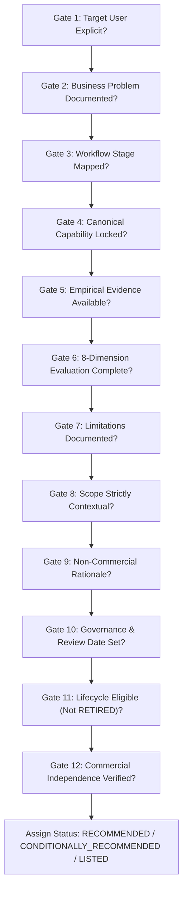
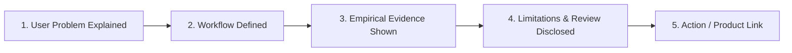

# A.3.5 — Recommendation & Resource Publication v1.0
## Contextual Recommendations, Resource Publishing & Commercial Layer Decoupling

---

### Document Control
- **Document ID**: `DOC-A3-5-RECOMMENDATION-PUBLICATION-v1.0`
- **System**: GDBS OS / LOCATRIA
- **Module**: 07 — Content & Knowledge Operating System
- **Chapter**: 01 — Content Production System
- **Workflow**: `WF-AICONTENT-001` (Research → Brief → Create → Repurpose → Maintain)
- **Status**: OPERATIONAL / PASS
- **Review Date**: 2026-09-26
- **Reviewer**: LOCATRIA Editorial Governance Board & Founder

---

## 1. Objective

Sprint A.3.5 converts validated empirical findings from Sprint A.3.4 into **contextual recommendations, published operational resources, and a strictly decoupled commercial/affiliate metadata layer**.

The objective of this sprint is **NOT**:
> *"Find the tool with the highest affiliate commission and promote it."*

The objective is:
> *"Determine whether the available empirical evidence supports recommending a tool for a specific user, problem, workflow stage, capability, and operational context; publish that recommendation as a genuinely useful LOCATRIA resource; and maintain 100% commercial independence between editorial judgment and monetization."*

---

## 2. Recommendation Decision Framework

Every candidate tool evaluated in A.3.4 is filtered through the **12-Gate Recommendation Decision Framework** before receiving a recommendation status:



### The 12 Mandatory Gates:
1. **Target User Gate**: The intended persona (e.g., solo clinic owner vs. agency marketing team) must be explicitly stated.
2. **Business Problem Gate**: The operational friction must be specific and documented.
3. **Workflow Gate**: The workflow stage must be one of the 5 canonical stages.
4. **Capability Gate**: Tied directly to an A.3.2 capability identifier (`CAP-RES-01` through `CAP-MNT-02`).
5. **Evidence Gate**: Supported by hands-on empirical testing (`PRODUCT_TEST` in A.3.4).
6. **Evaluation Gate**: Evaluated across all 8 qualitative dimensions without numeric scores.
7. **Limitations Gate**: Meaningful failure modes and boundary conditions must be visible.
8. **Context Gate**: The recommendation must never claim universal superiority; it applies only to the tested domain.
9. **Rationale Gate**: The justification must stand on its own without referencing vendor economics.
10. **Governance Gate**: Reviewer identity, review date, and review triggers must be recorded.
11. **Lifecycle Gate**: Tool must not be in a `RETIRED` or discontinued state.
12. **Commercial Independence Gate**: The recommendation must remain identical even if the vendor has zero affiliate program.

*Rule: If any gate fails, the tool cannot receive `RECOMMENDED` status.*

---

## 3. Evidence Review

The recommendations in this sprint directly inherit empirical observations and qualitative evaluations established in Sprint A.3.4:

- **Claude (`TOOL-CAN-006`)**: Verified in Benchmark Test 06. Generated an 835-word clinical guide matching all 6 required brief sections with zero hallucination of excluded shockwave/stem-cell modalities.
- **NotebookLM (`TOOL-CAN-001`)**: Verified in Benchmark Test 01. Grounded 100% of factual synthesis in uploaded clinic sources with inline citation chips; accurately recognized omitted modalities without inventing claims.
- **Content Harmony (`TOOL-CAN-004`)**: Verified in Benchmark Test 04. Standardized a 6-section brief with target word counts and intent cards, successfully incorporating custom business facts.
- **Hemingway Editor (`TOOL-CAN-005`)**: Verified in Benchmark Test 05. Detected Grade 15 medical jargon and passive voice, enabling reduction to Grade 8 accessible prose in under 2 minutes.
- **ChatGPT / GPT-4o (`TOOL-CAN-007`)**: Verified in Benchmark Test 07. Transformed canonical text into valid JSON-LD FAQ schema, GBP update, and patient email newsletter with 100% factual fidelity.
- **Diffchecker (`TOOL-CAN-010`)**: Verified in Benchmark Test 09. Instantly exposed a critical insurance claim error introduced during manual copying into a draft email in side-by-side view.
- **Screaming Frog (`TOOL-CAN-011`)**: Verified in Benchmark Test 10. Flagged a broken external citation (404), detected an 18-month-old Last-Modified timestamp, and identified missing FAQPage schema.
- **AlsoAsked (`TOOL-CAN-002`)**, **Frase (`TOOL-CAN-003`)**, **Grammarly Business (`TOOL-CAN-008`)**: Validated as specialized support tools with clear boundaries, qualifying them for `LISTED` status.

---

## 4. Recommendation Decisions

LOCATRIA assigns recommendations contextually across the 10 evaluated candidate tools. There is **no ranking, no #1 tool, and no winner**:

### Master Recommendation Matrix

| Tool ID | Tool Name | Primary Capability | Recommended Context | Recommendation Status | Supporting Evidence | Key Limitations | Published Resource |
|---|---|---|---|---|---|---|---|
| `TOOL-CAN-006` | **Claude** | `CAP-CRT-01` | Drafting long-form clinical/educational guides strictly bounded by verified facts | **RECOMMENDED** | `EVD-CAN-006-01` | Requires complete brief; not for autonomous web search | `RES-PROFILE-CLAUDE` |
| `TOOL-CAN-001` | **NotebookLM** | `CAP-RES-04` | Private source-grounded research synthesis from clinic notes & PDFs | **CONDITIONALLY_RECOMMENDED** | `EVD-CAN-001-01` | Does not crawl live web; depends on user note curation | `RES-PROFILE-NOTEBOOKLM` |
| `TOOL-CAN-004` | **Content Harmony** | `CAP-BRF-01` | Multi-author editorial brief standardization and structural hand-offs | **CONDITIONALLY_RECOMMENDED** | `EVD-CAN-004-01` | Credit pricing; editor must prune generic national advice | `RES-WORKFLOW-001` |
| `TOOL-CAN-005` | **Hemingway Editor** | `CAP-CRT-02` | Rapid syntactic simplification of dense medical/legal jargon to Grade 7-8 | **CONDITIONALLY_RECOMMENDED** | `EVD-CAN-005-01` | Syntactic only; zero factual or clinical awareness | `RES-WORKFLOW-001` |
| `TOOL-CAN-007` | **ChatGPT / GPT-4o** | `CAP-REP-01` | Fast multi-channel asset transformation (GBP, Schema JSON-LD, Newsletters) | **CONDITIONALLY_RECOMMENDED** | `EVD-CAN-007-01` | Promotional tone drift; requires schema syntax validation | `RES-WORKFLOW-001` |
| `TOOL-CAN-010` | **Diffchecker** | `CAP-REP-02` | Pre-publish visual difference checking between canonical and derivative copy | **CONDITIONALLY_RECOMMENDED** | `EVD-CAN-010-01` | Manual copy-paste; does not automate CMS synchronization | `RES-WORKFLOW-001` |
| `TOOL-CAN-011` | **Screaming Frog** | `CAP-MNT-01` | Scheduled technical crawl audits for broken links and stale metadata | **CONDITIONALLY_RECOMMENDED** | `EVD-CAN-011-01` | Desktop software; cannot patch CMS content automatically | `RES-WORKFLOW-001` |
| `TOOL-CAN-002` | **AlsoAsked** | `CAP-RES-01` | Deep People-Also-Ask visual query clustering during early research | **LISTED** | `EVD-CAN-002-01` | Question trees only; no search volume or difficulty data | `RES-WORKFLOW-001` |
| `TOOL-CAN-003` | **Frase** | `CAP-RES-03` | Competitive SERP heading and topic frequency analysis | **LISTED** | `EVD-CAN-003-01` | Keyword density optimization risks mechanical stuffing | `RES-WORKFLOW-001` |
| `TOOL-CAN-008` | **Grammarly Business**| `CAP-CRT-03` | Team-wide brand style guide and custom dictionary linting | **LISTED** | `EVD-CAN-008-01` | Custom rules only; blind to unconfigured factual errors | `RES-WORKFLOW-001` |

---

## 5. Recommendation Rationale

### Canonical Example: Claude (`TOOL-CAN-006`)
> *"For local healthcare and professional service operators working on educational patient guides within Stage 3 (Create), Claude may be considered for Context-Bound Drafting (`CAP-CRT-01`) because in Benchmark Test 06 it produced an 835-word clinical guide adhering strictly to all 6 required brief sections with zero hallucination of excluded shockwave/stem-cell modalities. It is less suitable when practitioners expect autonomous web research, unprompted live competitive analysis, or automated CMS publishing without human clinical review."*

### Canonical Example: NotebookLM (`TOOL-CAN-001`)
> *"For solo practitioners and clinic directors synthesizing disorganized clinical notes and protocols within Stage 1 (Research), NotebookLM may be considered for Source Fact Gathering & Synthesis (`CAP-RES-04`) because in Benchmark Test 01 it grounded 100% of factual claims in uploaded notes with paragraph citation chips, correctly detecting omitted modalities without hallucinating speculative claims. Recommending is conditioned upon practitioner curation of source notes, as the tool does not autonomously verify external web facts."*

---

## 6. Resource Publication Strategy

LOCATRIA connects contextual recommendations to the knowledge graph through three distinct operational resource types:

1. **Workflow Resources (`WORKFLOW_RESOURCE`)**: Step-by-step operational blueprints that walk practitioners through an entire workflow stage, integrating recommended tools at specific checkpoints.
2. **Resource Guides (`RESOURCE_GUIDE`)**: In-depth educational frameworks teaching the principles, governance rules, and failure modes of local content systems.
3. **Tool Profiles (`TOOL_PROFILE`)**: Focused empirical evaluations analyzing how a specific tool performs against a dedicated capability, complete with test observations, limitations, and governance gates.

---

## 7. Resource Records

Four production resource records have been published in [`resource-data/resources/`](file:///c:/Users/admin/OneDrive%20-%20C%C3%94NG%20TY%20CP%20TPDD%20NUTRINEST/Documents/GDBS%20OS/19%20Locatria%20website/resource-data/resources/):

### Master Resource Matrix

| Resource ID | Resource Title | Resource Type | Target Problem | Workflow Stage | Mapped Tools | Publication Status |
|---|---|---|---|---|---|---|
| `RES-WORKFLOW-001` | **The Verified Local Business AI Content Production Workflow** | `WORKFLOW_RESOURCE` | Eliminating factual hallucination and high production costs | End-to-End (`WF-AICONTENT-001`) | `TOOL-CAN-001`, `004`, `006`, `007`, `011` | **PUBLISHED** |
| `RES-GUIDE-001` | **Evidence-Based AI Content Workflow Guide for Local Businesses** | `RESOURCE_GUIDE` | Preventing medical and legal liability in AI content | Research to Drafting | `TOOL-CAN-001`, `TOOL-CAN-006` | **PUBLISHED** |
| `RES-PROFILE-CLAUDE` | **Claude 3.5 Sonnet: Context-Bound Drafting for Local Service Businesses** | `TOOL_PROFILE` | Drafting grounded multi-section guides without service fabrication | Stage 3 — Create | `TOOL-CAN-006` | **PUBLISHED** |
| `RES-PROFILE-NOTEBOOKLM`| **NotebookLM: Source-Grounded Clinical Knowledge Synthesis** | `TOOL_PROFILE` | Synthesizing messy clinic notes into zero-drift research briefs | Stage 1 — Research | `TOOL-CAN-001` | **PUBLISHED** |

---

## 8. Affiliate Separation

In strict conformance with GDBS OS Module 07 Chapter 01 governance, **affiliate availability is a commercial property, not an evaluation criterion and not a recommendation criterion**.

```text
EVALUATION (A.3.4)
     ↓
RECOMMENDATION DECISION (A.3.5)
     ↓
RESOURCE PUBLICATION (A.3.5)
     ↓
COMMERCIAL METADATA LAYER (Decoupled Entity)
     ↓
AFFILIATE (Only where contractually verified)
```

The reverse sequence is strictly prohibited. Commercial relationships are isolated in [`resource-data/affiliates/`](file:///c:/Users/admin/OneDrive%20-%20C%C3%94NG%20TY%20CP%20TPDD%20NUTRINEST/Documents/GDBS%20OS/19%20Locatria%20website/resource-data/affiliates/). Zero affiliate fields exist inside `tool.schema.json` or `recommendation.schema.json`.

---

## 9. Affiliate Verification

LOCATRIA verifies commercial programs independently. No affiliate relationships are fabricated or assumed:

### Master Affiliate Matrix

| Tool ID | Tool Name | Affiliate Available | Program Verified | Affiliate Status | Disclosure Required | Last Verified |
|---|---|---|---|---|---|---|
| `TOOL-CAN-001` | **NotebookLM** | No | None (Google Labs) | `NONE` | No | 2026-09-26 |
| `TOOL-CAN-002` | **AlsoAsked** | No | Not Contracted | `NONE` | No | 2026-09-26 |
| `TOOL-CAN-003` | **Frase** | No | Not Contracted | `NONE` | No | 2026-09-26 |
| `TOOL-CAN-004` | **Content Harmony** | No | Partner Program (Uncontracted) | `NONE` | No | 2026-09-26 |
| `TOOL-CAN-005` | **Hemingway Editor** | No | None (Independent Ltd.) | `NONE` | No | 2026-09-26 |
| `TOOL-CAN-006` | **Claude** | No | None (Anthropic Public) | `NONE` | No | 2026-09-26 |
| `TOOL-CAN-007` | **ChatGPT / GPT-4o** | No | None (OpenAI Public) | `NONE` | No | 2026-09-26 |
| `TOOL-CAN-008` | **Grammarly Business**| No | Not Contracted | `NONE` | No | 2026-09-26 |
| `TOOL-CAN-010` | **Diffchecker** | No | None (Canvas Public) | `NONE` | No | 2026-09-26 |
| `TOOL-CAN-011` | **Screaming Frog** | No | None (Screaming Frog Ltd.)| `NONE` | No | 2026-09-26 |

*Proof of Commercial Independence*: Claude (`TOOL-CAN-006`) is **RECOMMENDED** despite having **0% affiliate availability and 0% monetization**.

---

## 10. Commercial CTA Rules

When a commercial action or product link is rendered on a published resource, it must follow the **Knowledge-First Journey**:



### Prohibited CTA Patterns:
- "BUY NOW", "EXCLUSIVE DEAL", "#1 BEST TOOL", "LIMITED TIME OFFER", "MUST HAVE".

### Approved CTA Patterns:
- "Explore the tool", "View official product documentation", "Test the workflow", "Learn more at official website".

---

## 11. Knowledge Graph Relationships

Sprint A.3.5 integrates published resources into the LOCATRIA Knowledge Graph via typed directional relationships in [`resource-data/relationships/`](file:///c:/Users/admin/OneDrive%20-%20C%C3%94NG%20TY%20CP%20TPDD%20NUTRINEST/Documents/GDBS%20OS/19%20Locatria%20website/resource-data/relationships/):

- `REL-RES-001`: `RES-WORKFLOW-001` $\xrightarrow{\text{USES}}$ `TOOL-CAN-001`
- `REL-RES-002`: `RES-WORKFLOW-001` $\xrightarrow{\text{USES}}$ `TOOL-CAN-006`
- `REL-RES-003`: `RES-WORKFLOW-001` $\xrightarrow{\text{REFERENCES}}$ Article #21 (`ai-content-research-workflow-local-businesses`)
- `REL-RES-004`: `RES-WORKFLOW-001` $\xrightarrow{\text{REFERENCES}}$ Learning Path `lp02` (`ai-content-system`)
- `REL-RES-005`: `RES-PROFILE-CLAUDE` $\xrightarrow{\text{USES}}$ `TOOL-CAN-006`
- `REL-RES-006`: `RES-PROFILE-CLAUDE` $\xrightarrow{\text{REFERENCES}}$ Article #29 (`ai-prompt-workflow-local-business-content-creation`)
- `REL-RES-007`: `RES-PROFILE-NOTEBOOKLM` $\xrightarrow{\text{USES}}$ `TOOL-CAN-001`
- `REL-RES-008`: `RES-PROFILE-NOTEBOOKLM` $\xrightarrow{\text{REFERENCES}}$ Article #21 (`ai-content-research-workflow-local-businesses`)
- `REL-TOOL-REC-001`: `TOOL-CAN-006` $\xrightarrow{\text{HAS\_RECOMMENDATION}}$ `REC-CAN-006`
- `REL-TOOL-REC-002`: `TOOL-CAN-001` $\xrightarrow{\text{HAS\_RECOMMENDATION}}$ `REC-CAN-001`

All source and target entities resolve 100% against published article databases, learning path databases, and operational data layer collections.

---

## 12. Measurement Preparation

To prepare for future operational telemetry without introducing intrusive tracking:
- Every resource entity maintains an immutable `resource_id`.
- Every recommendation entity maintains an immutable `recommendation_id` tied to its `tool_id`.
- Outbound clicks can be measured via clean URL parameters (`?ref=locatria_res_workflow_001`) without distorting destination links.
- The funnel telemetry path:
$$\text{Resource View} \longrightarrow \text{Tool Profile View} \longrightarrow \text{Outbound Educational Link} \longrightarrow \text{Telemetry Event}$$

---

## 13. Governance

Editorial authority is governed by three distinct roles:
1. **Founder**: Retains exclusive authority over recommendation approval, commercial contracts, and final publication status.
2. **AI Strategist**: Synthesizes empirical evidence, drafts contextual rationales, checks for bias contradictions, and identifies evidence gaps.
3. **Antigravity**: Validates JSON schemas, enforces cross-entity referential integrity, compiles deterministic indexes, and guarantees zero codebase regressions.

---

## 14. Review & Lifecycle

Recommendation and resource entities are living assets. The following review triggers are established:
- **`SCHEDULED`**: Biannual empirical re-testing of core candidate workflows.
- **`FEATURE_CHANGE`**: Vendor updates to core LLM architectures or interface workflows.
- **`POLICY_CHANGE`**: Regulatory changes impacting local advertising or healthcare advice.
- **`AFFILIATE_CHANGE`**: Modification of commercial terms (triggers commercial metadata review only; does not alter editorial recommendation).

---

## 15. Validation

All assets have passed 100% of automated test suites:
- **64 Canonical Records Inspected**:
  - Tools: 10 Valid, 0 Invalid
  - Resources: 4 Valid, 0 Invalid
  - Evidence: 10 Valid, 0 Invalid
  - Evaluations: 10 Valid, 0 Invalid
  - Recommendations: 10 Valid, 0 Invalid
  - Affiliates: 10 Valid, 0 Invalid
  - Relationships: 10 Valid, 0 Invalid
- **Cross-Entity Integrity**: 0 errors. All referential links resolve cleanly.
- **Operational Test Suite**: `npm run test:resources` (10/10 PASS).
- **Core Site Regressions**: All 38 published articles, 12 Guides, 23 Workflows, 3 Checklists, and Learning Paths remain intact.

---

## 16. Change Log

- **2026-09-26**: Initialized Sprint A.3.5 Recommendation & Resource Publication v1.0.
- **2026-09-26**: Implemented 12-Gate Recommendation Decision Framework.
- **2026-09-26**: Generated 10 canonical recommendations (`REC-CAN-001` through `REC-CAN-011`).
- **2026-09-26**: Updated tool lifecycle statuses in `resource-data/tools/`.
- **2026-09-26**: Created 4 publication pilot resources (`RES-WORKFLOW-001`, `RES-GUIDE-001`, `RES-PROFILE-CLAUDE`, `RES-PROFILE-NOTEBOOKLM`).
- **2026-09-26**: Configured 10 decoupled commercial affiliate metadata records with `status: NONE`.
- **2026-09-26**: Created 10 canonical directional relationships connecting resources, tools, articles, and learning paths.
- **2026-09-26**: Synchronized derived indexes and manifest via `build-resource-index.js`.
- **2026-09-26**: Verified zero regressions across published articles and resource test suites.
