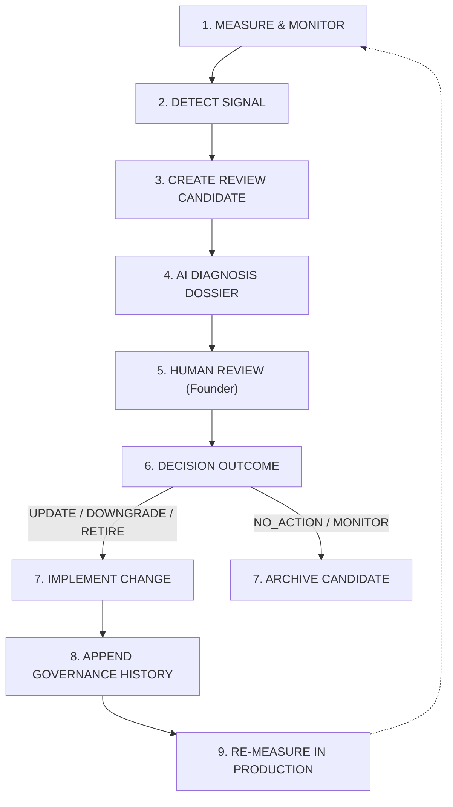

# Resource Review & Improvement Loop Framework v1.0
## Continuous Improvement Lifecycle, Review Candidate Models, Diagnosis Framework & Governance Boundaries

---

### Document Control
- **Document ID**: `DOC-A4-5-REVIEW-IMPROVEMENT-LOOP-v1.0`
- **System**: GDBS OS / LOCATRIA
- **Module**: 07 — Content & Knowledge Operating System
- **Chapter**: 01 — Content Production System
- **Sprint**: A.4.5 — Review & Improvement Loop v1.0
- **Status**: OPERATIONAL / PASS
- **Review Date**: 2026-09-26
- **Reviewer**: LOCATRIA Editorial Governance Board & Founder

---

## 1. Purpose & Continuous Improvement Philosophy

The purpose of **A.4.5 — Review & Improvement Loop v1.0** is to transform the LOCATRIA Resource Layer into a living, controlled, continuous-improvement system. 

Digital knowledge, AI capabilities, and search visibility conditions evolve constantly. To maintain uncompromising editorial authority, published resources cannot remain static. The Review & Improvement Loop establishes an evidence-based pipeline that monitors signals, creates auditable review candidates, executes structured diagnosis, enforces human decision-making, implements verified updates, and measures post-implementation impact:

```text
Measurement (Reach, Engagement, Actions)
      ↓
Signal / Trigger (A.4.1 Trigger or A.4.4 Signal)
      ↓
Review Candidate (Auditable Investigation Record)
      ↓
Diagnosis (Structured 6-Question Analysis)
      ↓
Human Review (Founder / Authorized Governance Lead)
      ↓
Decision (Actionable Verdict & Rationale)
      ↓
Implementation (Update / Downgrade / Retire / Commercial Update)
      ↓
Re-Measurement (Closed-Loop Telemetry Verification)
      ↺
```

---

## 2. Improvement Principles

1. **Signals Prompt Investigation, Not Automatic Decisions**: Telemetry changes and external triggers produce auditable review candidates; they **never** alter editorial content, tool scores, or recommendations automatically.
2. **AI Proposes, Human Decides**: AI models assist in detecting anomalies, organizing evidence dossiers, and drafting diagnostic hypotheses. Final decision-making authority rests exclusively with authorized human leadership (Founder).
3. **Traffic $\neq$ Quality**: High pageviews do not imply content perfection; low pageviews do not imply poor quality or obsolescence.
4. **Commercial Decoupling**: Affiliate clicks, conversions, or revenue surges can **never** upgrade an editorial recommendation or prevent a deserved downgrade.
5. **No Blind Updates**: Every material content alteration, capability adjustment, or retirement requires a documented business reason, supporting evidence, and a signed review record.
6. **Immutable Decision History**: All past decisions, previous states, and audit trails must be permanently preserved in version-controlled records.
7. **Legitimate Empty Baseline**: The absence of active review candidates or telemetry anomalies is a valid, healthy operational state. Zero mock reviews or artificial emergencies are fabricated.

---

## 3. Review Trigger Model

The system unifies external governance triggers (from Sprint A.4.1) with internal measurement signals (from Sprint A.4.4):

```mermaid
flowchart TD
    subgraph External Triggers [A.4.1 Governance]
        T1["SCHEDULED (Biannual Check)"]
        T2["PRICE_CHANGE (Vendor Pricing Shift)"]
        T3["FEATURE_CHANGE (Model / UI Update)"]
        T4["AFFILIATE_CHANGE (Network / Terms Shift)"]
        T5["USER_FEEDBACK (Practitioner Defect Report)"]
        T6["POLICY_CHANGE (Statutory / FTC Regulatory)"]
        T7["SOURCE_CHANGE (Clinical / Legal Guideline)"]
    end

    subgraph Measurement Signals [A.4.4 Telemetry]
        S1["LOW_ENGAGEMENT_SIGNAL (Dwell < 20%)"]
        S2["HIGH_ENGAGEMENT_SIGNAL (Dwell >= 40%)"]
        S3["WEAK_USER_ACTION_SIGNAL (Zero Onward Steps)"]
        S4["STRONG_USER_ACTION_SIGNAL (High Tool Visits)"]
        S5["COMMERCIAL_ACTIVITY (Outbound Clicks)"]
    end

    External Triggers --> RC["Canonical Review Candidate (RC-*)"]
    Measurement Signals --> RC
```

---

## 4. The Six Canonical Review Types

Reviews are grouped into six dedicated categories based on the affected operational domain:

| Review Type | Scope of Audit | Target Entities | Primary Triggers |
| :--- | :--- | :--- | :--- |
| **`CONTENT_REVIEW`** | Accuracy, readability, section flow, negative guidance | Resources (`RES-*`), Articles | `LOW_ENGAGEMENT_SIGNAL`, `WEAK_USER_ACTION_SIGNAL`, `USER_FEEDBACK` |
| **`TOOL_REVIEW`** | Functional capability, instruction adherence, limitations | Tools (`TOOL-*`), Evidence (`EVD-*`) | `FEATURE_CHANGE`, `SOURCE_CHANGE` |
| **`COMMERCIAL_REVIEW`** | Affiliate links, partner network status, disclosures | Affiliates (`AFF-*`) | `AFFILIATE_CHANGE`, `PRICE_CHANGE`, `COMMERCIAL_ACTIVITY` |
| **`GOVERNANCE_REVIEW`** | Schema compliance, lifecycle status, review cadences | All Entities | `SCHEDULED`, `POLICY_CHANGE` |
| **`PERFORMANCE_REVIEW`**| Telemetry anomaly analysis, discovery channel drift | Resources (`RES-*`) | `INSUFFICIENT_DATA`, `LOW_ENGAGEMENT_SIGNAL` |
| **`COMPREHENSIVE_REVIEW`**| Multi-vector re-assessment (content + tool + commercial)| Resource + Tool pairs | Complex multi-signal anomalies |

---

## 5. Review Candidate Model

A **Review Candidate** is the foundational unit of investigation. It captures incoming signals, assigns severity, and tracks progress through resolution:

```yaml
review_candidate_id: "RC-NOTEBOOKLM-2026Q3"
resource_id: "RES-PROFILE-NOTEBOOKLM"
tool_id: "TOOL-CAN-001"
trigger: "FEATURE_CHANGE"
detected_at: "2026-09-26"
source: "VENDOR_RELEASE_NOTES"
signal: "Google announced Audio Overview generation and expanded context window."
severity: "MEDIUM" # Options: LOW | MEDIUM | HIGH | CRITICAL
reason: "Audio Overview feature alters multimodal briefing capability; assess whether CAP-RES-04 synthesis remains grounded."
evidence_refs:
  - "EVD-CAN-001-01"
measurement_refs: []
proposed_review_type: "TOOL_REVIEW"
assigned_reviewer: "LOCATRIA Technical Director / Founder"
status: "OPEN" # Options: OPEN | IN_REVIEW | DECISION_REQUIRED | RESOLVED | CLOSED | DISMISSED
```

### Candidate Lifecycle States
```text
OPEN ──> IN_REVIEW ──> DECISION_REQUIRED ──> RESOLVED ──> CLOSED
  │                                            ▲
  └─────────────[Dismissed as Noise]───────────┴──> DISMISSED
```

---

## 6. The Structured 6-Question Diagnosis Framework

Before human reviewers decide on an action, the system (assisted by AI) compiles a structured diagnosis dossier answering six mandatory questions:

```text
┌──────────────────────────────────────┬─────────────────────────────────────────────────────────────┐
│ Diagnostic Question                  │ Focus & Standard of Proof                                   │
├──────────────────────────────────────┼─────────────────────────────────────────────────────────────┤
│ 1. What changed?                     │ Factually identify the external event or telemetry shift.   │
├──────────────────────────────────────┼─────────────────────────────────────────────────────────────┤
│ 2. Is the signal reliable?           │ Assess statistical confidence, sample size, or source truth.│
├──────────────────────────────────────┼─────────────────────────────────────────────────────────────┤
│ 3. What evidence supports it?        │ Cross-reference benchmark logs, user tickets, or release notes│
├──────────────────────────────────────┼─────────────────────────────────────────────────────────────┤
│ 4. What is the primary domain?       │ Classify into Content, Tool, Commercial, or Governance.     │
├──────────────────────────────────────┼─────────────────────────────────────────────────────────────┤
│ 5. What is the likely impact?        │ Estimate practitioner risk, clinical liability, or UX friction│
├──────────────────────────────────────┼─────────────────────────────────────────────────────────────┤
│ 6. What action is justified?         │ Propose one of the 8 canonical decision outcomes.           │
└──────────────────────────────────────┴─────────────────────────────────────────────────────────────┘
```

---

## 7. The Decision Framework & Action Rules

Review investigations conclude with an auditable **Decision Record** signed by an authorized human reviewer:

### Canonical Decision Outcomes:

1. **`NO_ACTION`**: Signal is transient, statistically insignificant, or within acceptable operating tolerances.
2. **`MONITOR`**: A potential trend or minor friction exists, but current evidence is insufficient to justify material changes. Re-evaluate at next scheduled cycle.
3. **`UPDATE`**: Content, workflow checkpoints, or metadata require direct refinement, clarification, or freshness patching.
4. **`DOWNGRADE`**: Empirical evidence or real-world practitioner feedback demonstrates that a tool no longer satisfies the rigorous criteria for its current recommendation tier (e.g., `RECOMMENDED` $\rightarrow$ `CONDITIONALLY_RECOMMENDED`).
5. **`RETIRE`**: A tool or resource is obsolete, abandoned by its vendor, introduces unacceptable security/liability risks, or is no longer maintainable.
6. **`RE_EVALUATE`**: Material product changes require executing the full 8-dimension empirical benchmark protocol in the lab.
7. **`RESEARCH_MORE`**: Critical uncertainties remain regarding API terms, pricing accessibility, or clinical safety; commissioning deeper investigation.
8. **`COMMERCIAL_UPDATE`**: Vendor affiliate parameters, links, or statutory disclosures require administrative updates with **strictly zero** editorial impact.

---

## 8. AI + Human + System Responsibilities & Boundaries

To ensure perfect accountability and guard against algorithmic drift:

```text
┌─────────────────┬─────────────────────────────────────────────────────────────────────────┐
│ Actor           │ Authorized Responsibilities & Inviolable Boundaries                     │
├─────────────────┼─────────────────────────────────────────────────────────────────────────┤
│ 1. AI           │ ✅ Detects measurement anomalies & groups related trigger events        │
│                 │ ✅ Compiles the 6-question diagnosis dossier                            │
│                 │ ✅ Drafts proposed content updates or re-structuring options            │
│                 │ ❌ CANNOT approve its own diagnosis                                     │
│                 │ ❌ CANNOT alter recommendation statuses                                 │
│                 │ ❌ CANNOT retire tools or resources                                     │
│                 │ ❌ CANNOT publish material content changes autonomously                 │
├─────────────────┼─────────────────────────────────────────────────────────────────────────┤
│ 2. Human        │ ✅ Validates the factual accuracy of the AI diagnosis                   │
│ (Founder/Lead)  │ ✅ Selects and executes the definitive decision outcome                 │
│                 │ ✅ Approves recommendation changes (Downgrades / Retirements)           │
│                 │ ✅ Personally reviews and authorizes material content releases          │
├─────────────────┼─────────────────────────────────────────────────────────────────────────┤
│ 3. System       │ ✅ Stores and validates Review Candidate entities                       │
│ (Engine/CI)     │ ✅ Blocks invalid lifecycle transitions and unapproved changes          │
│                 │ ✅ Permanently appends audit trails to entity governance metadata        │
│                 │ ✅ Enforces commercial decoupling invariants                            │
└─────────────────┴─────────────────────────────────────────────────────────────────────────┘
```

---

## 9. The Closed-Loop Improvement Lifecycle

The system forms a continuous closed loop:



Every material update returns to Layer 02/03 measurement to verify that the intervention improved practitioner engagement and resolved the initial bottleneck.

---

## 10. Governance Boundaries & Decoupling Invariants

The validation engine ([`validation/resource-review-loop.js`](file:///c:/Users/admin/OneDrive%20-%20C%C3%94NG%20TY%20CP%20TPDD%20NUTRINEST/Documents/GDBS%20OS/19%20Locatria%20website/validation/resource-review-loop.js)) programmatically enforces four unbreakable governance boundaries:

1. **Boundary 1: Low Traffic $\neq$ Retirement**: Low pageviews alone can **never** trigger automatic tool or resource retirement. If a specialized guide addresses a rare clinical edge case accurately, its knowledge value remains absolute.
2. **Boundary 2: High Revenue $\neq$ Upgrade**: Surges in commercial affiliate revenue can **never** upgrade a tool’s recommendation status or influence ranking order.
3. **Boundary 3: Commercial Changes are Contained**: `AFFILIATE_CHANGE` events trigger `COMMERCIAL_REVIEW` and `COMMERCIAL_UPDATE` only. They are barred from altering resource instructional text or tool benchmark scores.
4. **Boundary 4: Feature Changes Demand Empirical Re-Evaluation**: When a vendor releases major updates, the tool cannot be subjectively praised or dismissed; it must route to `RE_EVALUATE` for empirical testing.

---

## 11. Versioning & Historical Decision Preservation

Whenever a decision modifies an entity, the system preserves an auditable history record:

```javascript
preserveReviewHistory(targetEntity, decisionRecord)
```

Appends to `targetEntity.governance.history`:
- `review_date`: Date the decision was executed (YYYY-MM-DD).
- `reviewer`: Identity of the human decision-maker.
- `decision`: Canonical outcome (`UPDATE`, `DOWNGRADE`, `RETIRE`, etc.).
- `rationale`: Substantive justification ($\ge 15$ chars).
- `previous_state` & `new_state`: Verifiable lifecycle progression.
- `recorded_at`: ISO timestamp of system execution.

---

## 12. Practical Operational Examples

### Example 1: Handling a Vendor Feature Update
1. **Trigger**: Anthropic releases Claude 3.7 with extended thinking capabilities (`FEATURE_CHANGE`).
2. **Review Candidate**: `RC-CLAUDE-37-UPDATE` created with severity `MEDIUM`.
3. **Diagnosis**: Question 5 identifies that extended thinking may alter long-form clinical constraint adherence. Question 6 proposes `RE_EVALUATE`.
4. **Human Review**: Founder approves lab re-evaluation.
5. **Action**: `RE_EVALUATE` executed. Tool temporarily enters `UNDER_REVIEW` in lab while production recommendation remains stable.
6. **Result**: Benchmark tests confirm zero hallucination drift. Resource profile updated with new token limits.

### Example 2: Handling Low Engagement Telemetry
1. **Signal**: Guide `RES-GUIDE-001` exhibits an engagement ratio of $14\%$ over 30 days (`LOW_ENGAGEMENT_SIGNAL`).
2. **Review Candidate**: `RC-GUIDE001-LOWENG` created with severity `LOW`.
3. **Diagnosis**: Audit reveals that the introductory section contains 450 words of theoretical context before introducing the diagnostic checklist.
4. **Human Review**: Founder directs restructuring to move the checklist to the top.
5. **Action**: `UPDATE` executed. Content restructured.
6. **Re-measurement**: Dwell time increases to $48\%$ over the subsequent 14-day window.

---

## 13. Integration with Sprints A.4.1–A.4.4

- **Sprint A.4.1 (Lifecycle Governance)**: Provides the baseline state machine transitions (`ALLOWED_TOOL_TRANSITIONS`, `ALLOWED_RECOMMENDATION_TRANSITIONS`).
- **Sprint A.4.2 (Affiliate Operations)**: Provides commercial decoupling rules and handles `COMMERCIAL_UPDATE` actions without editorial crossover.
- **Sprint A.4.3 (Content Production)**: Provides production QA gates and Resource Brief contracts used when an `UPDATE` decision requires re-drafting.
- **Sprint A.4.4 (Measurement)**: Feeds empirical signals (`LOW_ENGAGEMENT_SIGNAL`, `WEAK_USER_ACTION_SIGNAL`) into Candidate creation and verifies post-update performance.

---

## 14. Automated Test Suite & Quality Enforcement

The Review & Improvement Loop is guarded by a dedicated 10-point automated test suite:
- **Test Script**: `validation/test-resource-review-loop.js`
- **CLI Command**: `node validation/test-resource-review-loop.js` (or `npm run test:review-loop`)

### Test Coverage Matrix:
1. **Test 01**: Valid Review Candidate passes validation.
2. **Test 02**: Invalid Review Candidate is blocked (missing target, invalid ID).
3. **Test 03**: Measurement signal successfully creates a Review Candidate.
4. **Test 04**: Affiliate change creates a commercial review only.
5. **Test 05**: Feature change correctly routes to re-evaluation.
6. **Test 06**: Low traffic does not automatically retire a Resource.
7. **Test 07**: Affiliate revenue does not automatically upgrade a Recommendation.
8. **Test 08**: AI cannot approve material review decisions (human sign-off enforced).
9. **Test 09**: Historical decision records are immutably preserved on entity metadata.
10. **Test 10**: Empty review state is valid (zero-fabrication baseline confirmed).

---

## 15. Current Implementation Status & Stop Condition Statement

Sprint A.4.5 is complete:
1. **Review Loop Fully Operational**: Complete `MEASURE -> DETECT -> DIAGNOSE -> HUMAN REVIEW -> DECIDE -> IMPLEMENT -> RE-MEASURE` workflow established.
2. **Zero Fabricated Records**: `resource-data/reviews/` contains **0 mock records** (`.gitkeep` only). Baseline integrity is preserved.
3. **Zero Recommendations Modified**: All existing recommendations, evaluations, and tools remain strictly untouched.
4. **No Dashboard Built**: System remains modular for downstream dashboarding in Sprint A.4.6.
